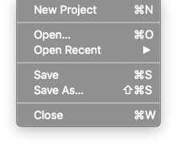
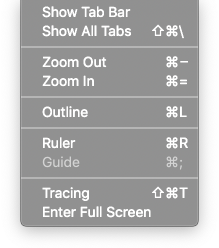
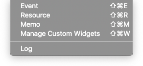
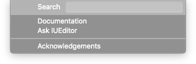

Menu
==========================

.. image:: resource/capture_window/mac_menu_bar_blk.png

Description about IUEditor Menu Bar

IUEditor
----------------------------

.. image:: resource/capture_window/iueditor.png

* ``About IUEditor`` : Show IUEditor's version info.
* ``Preference`` : Open IUEditor :doc:`Preference<009_00_preference>` window.

File
----------------------------

* ``New Project`` : Open New Project window.
* ``Open`` : Open Finder to find IU Project file to open.
* ``Open Recent`` : Open recent IU Project file.
* ``Save`` : Save the current project.
* ``Save As`` : Save the current project under a different name.
* ``Close`` : Close current project.

Project
----------------------------

.. image:: resource/capture_window/project.png

* ``Build`` : Generate HTML & CSS & JS files based on IU Project.
* ``Build Clean`` : Clean build data. It can fix program error.
* ``Stop`` : Stop the build.
* ``Project Setting`` : Open :doc:`Project Setting<004_01_panel_project_setting>` panel.
* ``Project Code`` : Open :doc:`Project Code<004_07_panel_project_code>` panel.
* ``Refresh Page`` : Refresh current page. It can fix program error.

View
----------------------------

* ``Show Tab Bar`` : Show the tab bar.
* ``Show All Tabs`` : Show the entire tab.
* ``ZoomOut`` : Zoom Out stage.
* ``ZoomIn`` : Zoom In stage.
* ``Outline`` : Show or hide outline of widgets in canvas.
* ``Ruler`` : Show or hide ruler on canvas.
* ``Guide`` : Show or hide guide on canvas.
* ``Tracing`` : Show or hide tracing image on canvas.
* ``Enter Full Screen`` : Switch to full screen.

Window
----------------------------

* ``Event`` : Open :doc:`Event panel<004_03_panel_event>`.
* ``Resource`` : Open :doc:`Resource panel<004_02_panel_resource>`.
* ``Memo`` : Open :doc:`Memo panel<004_04_panel_memo>`.
* ``Manage Custom Widgets`` : Open :doc:`Manage Custom Widgets Panel<004_05_panel_manage_custom>`.
* ``Log`` : Open log panel.

Help
----------------------------

* ``Search`` : Search IUEditor function.
* ``Documentation`` : Open IUEditor Manual page in the browser.
* ``Ask IUEditor`` : Go to the webpage to ask questions about the program.
* ``Acknowledgements`` : Show information about the APIs used in the program.
