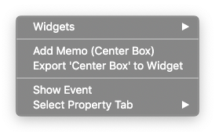
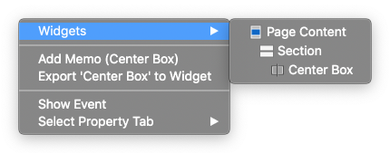
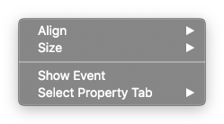
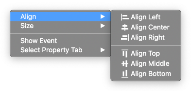
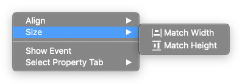

.. _Memo Panel : ./panel_memo.html
.. _Event Panel : ./panel_event.html
.. _Tab Menu : ./basic_top_toolbar.html#id2
.. _Export Widget Panel : ./panel_export_widget.html

Canvas
===========

.. thumbnail:: resource_new/canvas.png

Canvas is the preview of the website. The structure designed on the canvas by **adding widgets**  will be shown in the web page.

:ref:`How to add widgets to canvas<How_to_add_widget_to_canvas>`

----------

Context Menu - Single Widget
----------------------------------------------

After selecting a single widget in canvas, right-click to open the **Context Menu**.
Below are information and functions in the Context Menu.

* ``Widgets`` : Shows the whole widgets placed at the current position of the mouse pointer.

* ``Add Memo`` : Opens `Memo Panel`_ where you can add memo about the selected widget.
* ``Export to Widget`` : Opens `Export Widget Panel`_ that is used to export **Custom Widget** .
* ``Show Event`` : Opens `Event Panel`_ that allows us to add an event to the selected widget and later make adjustments on events
* ``Select Tab`` : Switches Property panel on the top to the selected `Tab`_

----------

Context Menu - Muiltiple Widgets
----------------------------------------------

After selecting multiple widgets in canvas, right-click to open the **Context Menu**.

* ``Align`` : Aligns the selected widgets according to the option chosen : **Align Left / Align Center / Align Right / Align Top / Align Middle / Align Bottom**

* ``Size`` : Fixes the size of the selected widgets according to the option chosen : **Match Width / Match Height**

