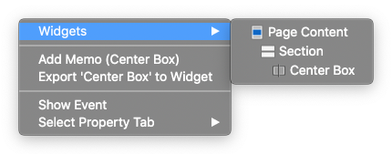
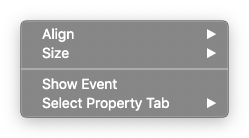
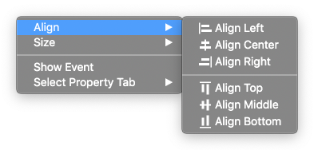

Canvas
===========

.. thumbnail:: resource/capture_window/canvas.png

Canvas is the preview of the website. The structure designed on the canvas by **adding widgets**  will be shown in the web page.

:ref:`How to add widgets to canvas<How_to_add_widget_to_canvas>`

Context Menu - Single Widget
----------------------------------------------

.. image:: resource/capture_window/single_widget_01.png

After selecting a single widget in canvas, right-click to open the **Context Menu**.
Below are information and functions in the Context Menu.

* ``Widgets`` : Shows the whole widgets placed at the current position of the mouse pointer.

* ``Add Memo`` : Open :doc:`Memo Panel<004_04_panel_memo>` where you can add memo about the selected widget.
* ``Export to Widget`` : Open :doc:`Export Widget Panel<004_06_panel_export>` that is used to export **Custom Widget** .
* ``Show Event`` : Open :doc:`Event Panel<004_03_panel_event>` that allows us to add an event to the selected widget and later make adjustments on events
* ``Select Tab`` : Switch Property panel on the top to the selected :ref:`Tab<Tab_Menu>`.

Context Menu - Multiple Widgets
----------------------------------------------

After selecting multiple widgets in canvas, right-click to open the **Context Menu**.

* ``Align`` : Align the selected widgets according to the option chosen : **Align Left / Align Center / Align Right / Align Top / Align Middle / Align Bottom**

* ``Size`` : Fix the size of the selected widgets according to the option chosen : **Match Width / Match Height**

.. image:: resource/capture_window/multi_widget_03.png
