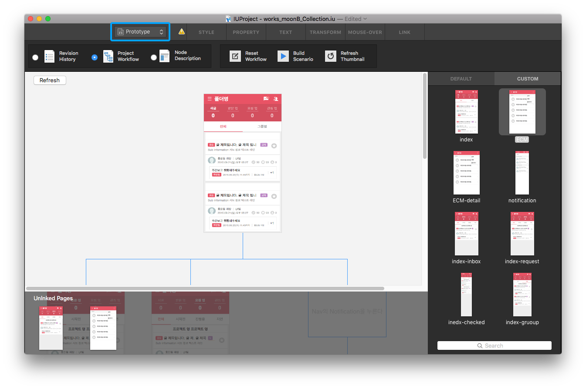
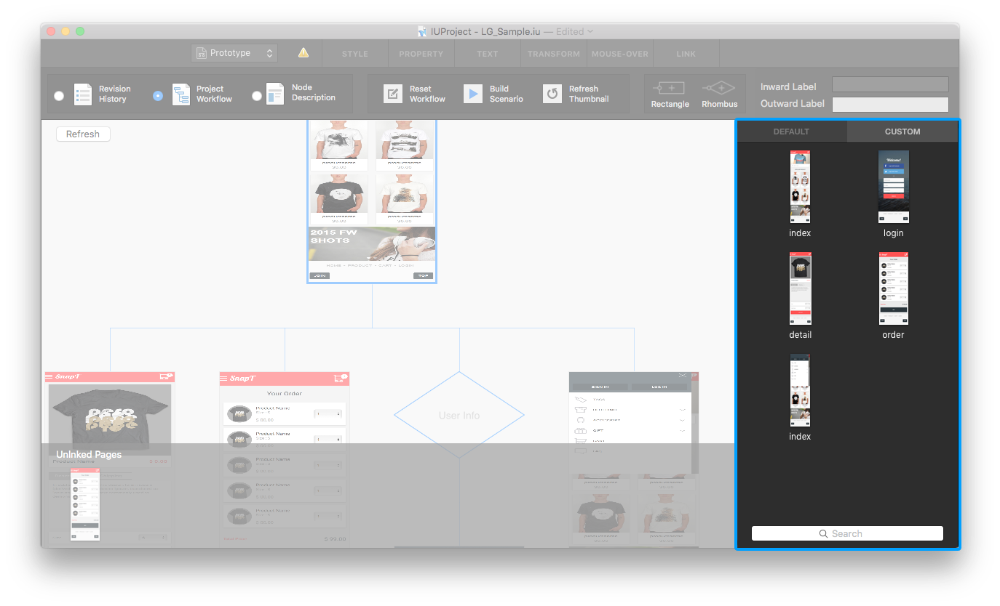
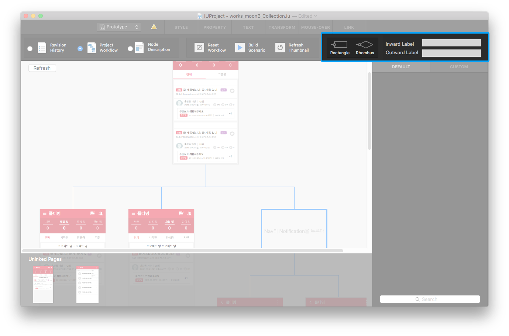

Prototype Mode
=======================

From the toolbar at the top, you can switch to **Prototype Mode** by clicking ``Mode Switch Button``.

Prototype Mode offers `Revision History`_ / `Project Workflow`_ / `Node Description`_ page. 
You can refresh scenario by clicking ``Reset Workflow`` and can build **HTML Scenario** by clicking ``Build Senario``.
And ``Refresh Thumbnail`` updates the page thumbnails that are included in the workflow and the page list.

----------

Revision History
-------------------------------
 
.. image:: resource/scenario/ic_SB_revision.png

Displays **the history of revision** made in the current project. You can add or change the history.

* ``Add New Date`` : Creates a new editable row field in the table.
* ``Remove Date `` : Deletes the selected row from table.
----------

Project Workflow
-------------------------------

.. image:: resource/scenario/ic_SB_workflow.png

Displays **Workflow** of the current project. Users can add nodes by drag and drop of page thumbnails. Press delete key to delete the selected node.

* ``Default thumbnails`` : A list of page thumbnails included in the project.
* ``Custom thumbnails`` : A list of page thumbnails captured by using **Page Capture Button** on the toolbar in editor mode.

.. note:: Thumbnails can be added by using **Page Capture Button**  in **Editor Mode**.

* ``Rectangle Button`` : Adds a square dialog below the selected node.
* ``Rhombus Button`` : Adds a diamond dialog below the selected node.

* ``Inward Label`` : Adds a label on top of the selected node.
* ``Outward Label`` : Adda a label below the selected node.

----------

Node Description
-------------------------------

.. image:: resource/scenario/ic_SB_screen.png

Displays the **Node Description** of the selected page. By adding memos to the node, you can send orders to partners of your collaborative project. You can also add or change content in the **Screen Description** or **Exception** area. Double-clicking the thumbnails on canvas also displays the node description.

* ``Memo image area`` : Selects an image from the resource panel to replace the numbering in the screenshot area.
* ``Add Memo Button`` : Creates a new editable row field in the table.
* ``Delete Button`` : Deletes the selected memo in the table.

When you click the screenshot area, the number of the selected memo will apear.
