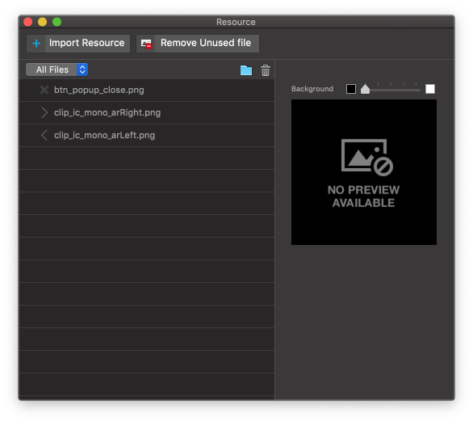

.. _Import Clipart : #id1
.. _Image Widget : ./widget_basic.html#image

Resource Panel
=======================

When you run **Window > Resource (⇧⌘R)** menu, Resource Panel will be shown. You can import resources (image / video / clipart) into Resource Panel.

.. note :: Supported File Type : jpg / png / git / svg / mp4

* ``Import Resource Button`` : Imports resources from the local disk.
* ``Import Clipart Button`` : Imports cliparts from `Import Clipart`_ .
* ``Resource Type Select Button`` : Sorts out files in Resource Panel by file type.
* ``Add New Folder Button`` : Adds a new folder.
* ``Delete Button`` : Deletes the selected file(s) or folder(s).

Resource Management Tips
----------------------------

* You can create groups and reorder files in resources.
* You can insert image resources to widget by drag & drop into `Image Widget`_ .
