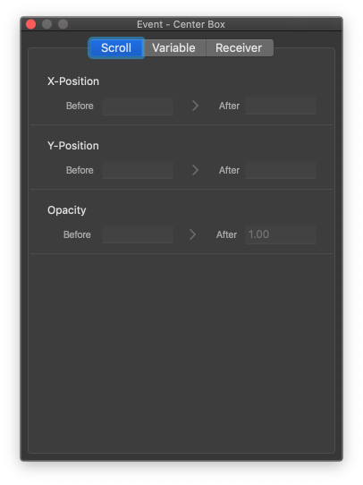
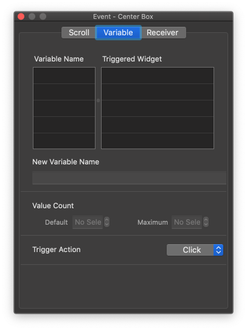
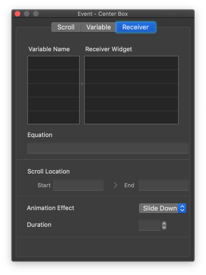

Event Panel
====================

When you run **Window > Event (⇧⌘E)** menu, Event Panel will be shown. You can add events like :ref:`Scroll Animator` or :ref:`Variable`.

----------

Scroll Animator
---------------

Add Scroll Animator to animate widget by scrolling. When the target widget appear in the middle of browser, the selected value will transform from before to after.

* ``X-Position`` : Add Scroll Animator to X-Position.
* ``Y-Position`` : Add Scroll Animator to Y-Position.
* ``Opacity`` : Add Scroll Animator to Opacity.

----------

Variable
----------------

Add Variable to the selected widget.

* ``Variable Name`` : Show Variable list in your project.

* ``Triggered Widget`` : Show Triggered widget list according to the selected variable.

* ``New Variable Name`` : Add a new variable name.

* ``Value Count`` : Set Default & Maximum value to the variable.

* ``Trigger Action`` : Set Trigger Action to the selected widget.

----------

Receiver
-------------

Add Receiver Event to the selected widget. When **Equation** returns True, Receiver Event will be shown.

* ``Variable Name`` : Show the list of variables that have Receiver Event.

* ``Receiver Widget`` : Show the list of Receiver Widget according to the selected variable.

* ``Equation`` : Set Equation case. (e.g. Sample Variable = 1)

* ``Scroll Location`` : Set Equation range of the scroll position.

* ``Animation Effect`` : Set Animation Effect when Receiver Event is run.

* ``Duration`` : Set Duration for the Receiver Event.
