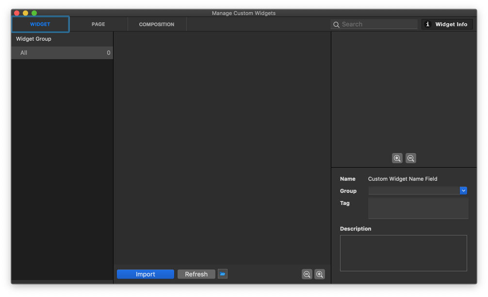

Manage Custom Widget Panel
==================================

When you run **Window > Manage Custom Widgets (⇧⌘W)** menu, Manage Custom Widgets Panel will be shown. You can import Custom Widgets, Compositions and Pages into this panel. This panel supports Grid / Table view in Widget list. You can open and close widget information area with toggle button next to the search box.

Top Bar
----------------------------

* ``Widget Tab`` : Manage imported custom widgets. Import custom widget with **import button**.
* ``Page Tab`` : Manage imported custom page. Import custom page with **import button**.
* ``Composition Tab`` : Manage imported custom composition. Import custom composition with **import button**.
* ``Widget Information Toggle Button`` : Show or hide `Custom Widget Information`_ area.
* ``Search Bar`` : Search by custom widget name.

Widget Group List
----------------------------

Widget Group List is placed at the left side of the panel. You can browse `Custom Widget List`_ by selecting the group name.

Custom Widget List
-------------------------------

Custom Widget List is placed at the center of the panel.

* ``Import`` : Import custom widget file. (iuw)
* ``Refresh`` : Refresh current widget list.
* ``Open Folder`` : Open custom widget folder.

Custom Widget Information
------------------------------

Custom Widget Info is placed at the right side of the panel.

* ``Preview`` : Show the preview of the selected custom widget.
* ``Zoom In / Out`` : Zoom In or Out on the preview.
* ``Name`` : Display the name of the selected custom widget.
* ``Group`` : Display the group of the selected custom widget.
* ``Tag`` : Display the list of tags added to custom widgets.
* ``Description`` : Display the description of the selected custom widget.
