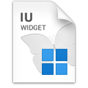
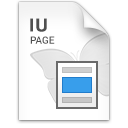
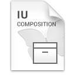

Export Widget Panel
==============================

You can open Export Widget Panel from the left side of the canvas:

* Right-click the widget in structure section
* Right-click the page in pages
* Right-click composition in compositions

.. thumbnail:: resource_new/panel_export_widget.png

* ``Customize Viewport Size`` : Resize viewport size of the custom widget.
* ``Name`` : Set name of custom widget.
* ``New Group`` : Set the group of the custom widget.
* ``Export Directory`` : Set the export directory of the custom widget.
* ``Description`` : Add descriptions to the custom widget.

----------

Export Widget (.iuw)
-----------------------------

When you export **Widget** , IUEditor generates ``CustomWidgetName.iuw`` file.

----------

Export Page (.iup)
-----------------------------

When you export **Page** , IUEditor generates ``CustomPageName.iup`` file.

----------

Export Composition (.iuc)
-----------------------------

When you export **Composition** , IUEditor generates ``CustomCompositionName.iuc`` file.
