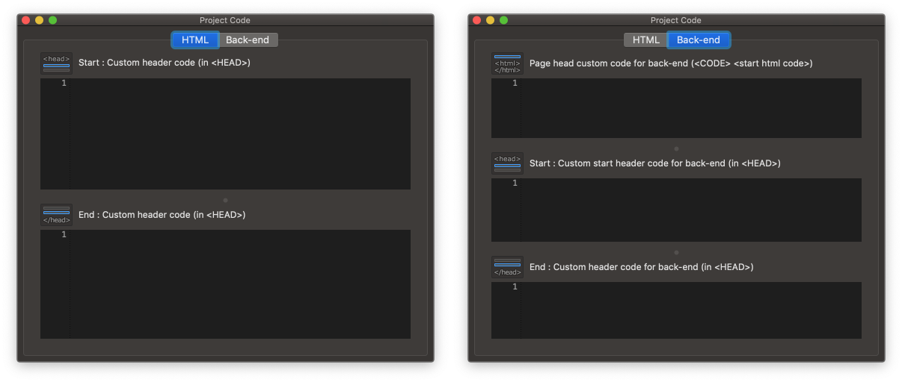

Project Code
==================

When you click the **Project > Project Code** :kbd:`⇧⌘C` button, Project Code panel will be shown.

You can add your code to all pages.

HTML
----------------

.. code:: html

  <head>
     <!-- start : your code -->
     <!-- auto generated code by IUEditor -->
     <!-- end : your code -->
   </head>

Back-end
---------------

.. code:: html

  <!-- page head custom code for back-end : your code -->
  <!DOCTYPE html>
  <head>
     <!-- start : your code -->
     <!-- auto generated code by IUEditor -->
     <!-- end : your code -->
   </head>
