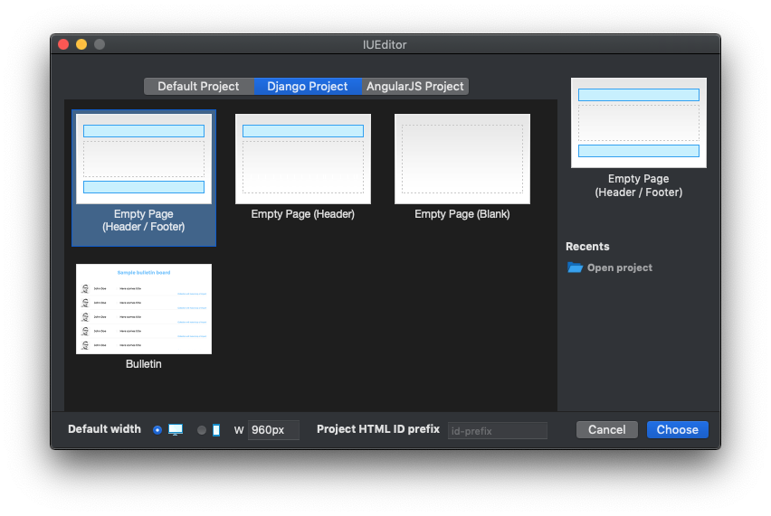

Project Type
=======================

.. image:: resource/icon_IU_128x128.png

-------------

Default Project
--------------------------

Default Project is a Static Project which is not connected with any back-end framework. You can select Default Project in **New Project Popup** (which pops up when you run **File > New Project (⌘N)** menu)

.. image:: resource/iu_manual_project_new_default.png

* ``Empty Page (Header / Footer)`` : Creates new project with **Empty Page (Header / Page Content / Footer)**
* ``Empty Page (Header)`` : Creates new project with **Empty Page (Header / Footer)**
* ``Empty Page (Blank)`` : Creates new project  with **Empty Page (Page Content)**

* ``IUPro`` : Creates new project with **IUPro** Template.
* ``Paper`` : Creates new project with **IUPaper** Template.
* ``IUAcademy`` : Creates new project with **IUAcademy** Template.

* ``Recent Project`` : Shows last 5 projects that recently have been updated.
* ``Open Project`` : Opens existing IU project.

.. note :: When you select Empty Page, you can set default width value of new project.

-------------

Django Project
-----------------------
.. _Django_Project:

Django Project is a Dynamic Project which can be connected with Django as back-end framework. You can select Django Project in **New Project Popup** (which pops up when you run **File > New Project (⌘N)** menu)

-------------

AngularJS Project
-----------------------

AngularJS Project is a Dynamic Project which can be connected with AngularJS as back-end framework. You can select AngularJS Project in **New Project Popup** (which pops up when you run **File > New Project (⌘N)** menu)

.. image:: resource/iu_manual_project_new_angularjs.png
