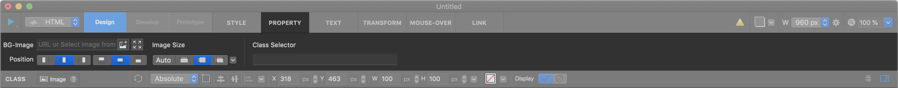
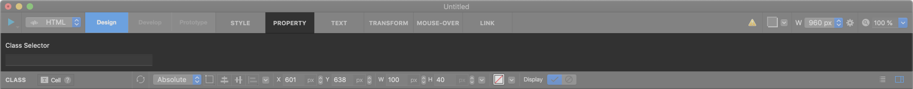
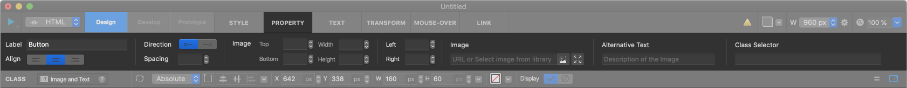

Basic Widget
============

.. _How_to_add_widget_to_canvas:

-----------

.. image:: resource/widget/IUBox.png

Box
----------

.. image:: resource_new/box.png

Box widget is a fundamental widget which is generated to 
 tag. Mostly, Box widget is used to set layout and to group children widgets.

**Property**

* Child : Valid
* Link : Valid
* Scroll Animator : Valid
* Background Image : Valid
* Backend Ellipsis : Invalid

.. raw:: html

    

       <iframe width="560" height="315" src="https://www.youtube.com/embed/_D5d3eKYFMw" frameborder="0" allowfullscreen></iframe>
    

----------

.. image:: resource/widget/IUText.png

Text
----------

.. image:: resource_new/text.png

Text widget contains **Text Content** which is generated to 
, <h1> or <h2> tag. You can edit text after double-click to widget.

**Property**

* Child : Invalid
* Link : Valid
* Scroll Animator : Valid
* Background Image : Valid
* Backend Ellipsis : Valid

.. raw:: html

    

        <iframe width="560" height="315" src="https://www.youtube.com/embed/zhllW9hdtm4" frameborder="0" allowfullscreen></iframe>
    

----------

.. image:: resource/widget/IUFloatingImage.png

Image
----------

Static Image widget contains **Image Content** which is generated to  tag. You can input image resource from Resource panel or Image URL link.

* ``Fit Widget Size to Image Size`` : Resize widget according to image resource size.

**Property**

* Child : Invalid
* Link : Valid
* Scroll Animator : Valid
* Background Image : Valid
* Backend Ellipsis : Valid

----------

.. image:: resource/widget/IUImage.png

Static Image
--------------

.. image:: resource_new/static_img.png

Image widget contains **Image Content** which is generated by css {background} tag. You can input image resource from Resource panel or Image URL link and resize or rearrange image in widget area.

* ``Fit Widget Size to Image Size`` : Resize widget according to image resource size.

**Property**

* Child : Invalid
* Link : Valid
* Scroll Animator : Valid
* Background Image : Invalid
* Backend Ellipsis : Invalid

.. raw:: html

    

        <iframe width="560" height="315" src="https://www.youtube.com/embed/RHax9vtH91I" frameborder="0" allowfullscreen></iframe>
    

----------

.. image:: resource/widget/IUCell.png

Cell
----------

Cell widget contains **Text Content** , aligned Vertical-Center automatically. (PX unit only)

**Property**

* Child : Invalid
* Link : Valid
* Scroll Animator : Valid
* Background Image : Valid
* Backend Ellipsis : Valid

.. raw:: html

    

       <iframe width="560" height="315" src="https://www.youtube.com/embed/l4XBFTpfmSM" frameborder="0" allowfullscreen></iframe>
    

----------

Image and Text
----------------

Image and text widget contains **Text Content** and **Image**, aligned Vertical-Center automatically.

**Property**

* Child : Invalid
* Link : Valid
* Scroll Animator : Valid
* Background Image : Valid
* Backend Ellipsis : Valid

----------
