Complex Widget
============

-----------

Transition
----------

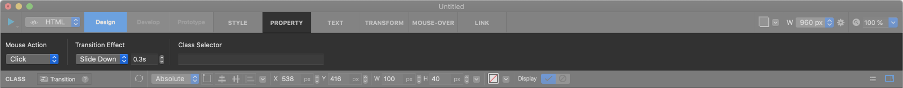

Transition widget has two transition items. When mouse action triggered, transition item will change from item 1 to item 2. You can set **Mouse Action (Mouse Over or Click)** , Transition Effect, and Duration in property panel.

**Property**

* Child : Invalid
* Link  : Valid
* Scroll Animator : Valid
* Background Image : Invalid
* Backend Ellipsis : Invalid

----------

.. image:: resource/widget/IUCarousel.png

Carousel
----------

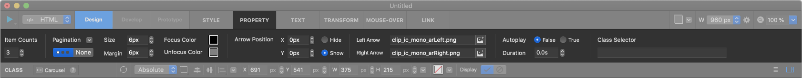

Carousel widget has multiple carousel items. You can simply make carousel interface with carousel widget. Carousel item is the same as Box widget, so you can add or remove child elements to Carousel item

**Property**

* Child : Invalid
* Link  : Valid(Only for child widget)
* Scroll Animator : Invalid
* Background Image : Invalid
* Backend Ellipsis : Invalid

----------

.. image:: resource/widget/IUGoogleMap.png

Google Map
----------

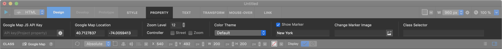

Google Map widget represents google map element. You can input **Map location** wherever you want.

.. note::
1) In Editor Mode, Google Map widget offers maximum preview 600 px x 600 px size.
2) South Korea's map is not available Color Theme feature.

**Property**

* Child : Invalid
* Link  : Invalid
* Scroll Animator : Valid
* Background Image : Invalid
* Backend Ellipsis : Invalid

----------

Web Movie
-----------------

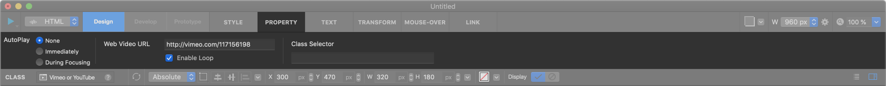

Web Movie widget supports Youtube or Vimeo. You can use Web Movie widget with **Short-Links** :

* ``Vimeo`` : http://vimeo.com/ **videoURL**
* ``Youtube`` : http://youtu.be/ **videoURL**

**Property**

* Child : Invalid
* Link  : Invalid
* Scroll Animator : Valid
* Background Image : Valid
* Backend Ellipsis : Invalid

----------

.. image:: resource/widget/IUMovie.png

Video Clip
----------

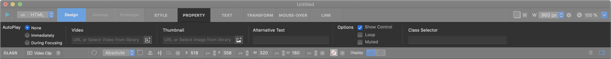

Video Clip widget supports MP4. You can input videos from Resource panel.

**Property**

* Child : Invalid
* Link  : Valid
* Scroll Animator : Valid
* Background Image : Valid
* Backend Ellipsis : Invalid

----------

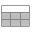

Table
----------

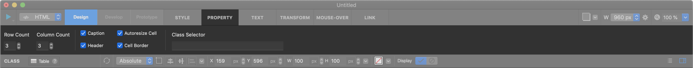

Table widget can add simple table on canvas.

**Property**

* Child : -
* Link  : -
* Scroll Animator : -
* Background Image : -
* Backend Ellipsis : -

----------

Simple Tab View
----------

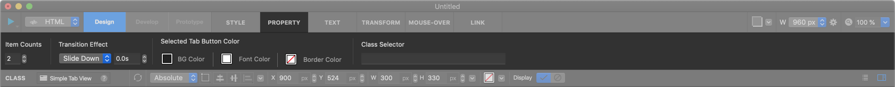

Simple Tab View widget has more simple structure than Tab View widget .

**Property**

* Child : -
* Link  : -
* Scroll Animator : -
* Background Image : -
* Backend Ellipsis : -

----------

.. image:: resource/widget/IUTabView.png

Tab View
----------

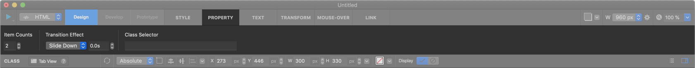

Tab View widget has multiple **Tabs** .

**Property**

* Child : -
* Link  : -
* Scroll Animator : -
* Background Image : -
* Backend Ellipsis : -

----------

.. image:: resource/widget/IUCollapsible.png

Collapsible
-------------

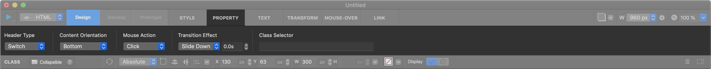

Collapsible widget has two item (Header and Content). When you triggered mouse action on Collapsible widget, Content item will be appeared. You can set **Mouse Action (Mouse Over or Click)** , Transition Effect, and Duration in property panel.

**Property**

* Child : -
* Link  : -
* Scroll Animator : -
* Background Image : -
* Backend Ellipsis : -

----------

Import
----------

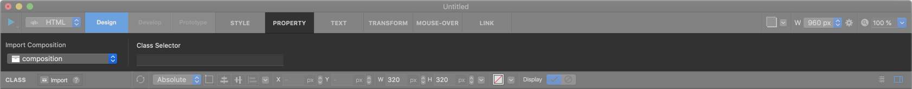

Import widget can import **Composition** . If you want to use Composition, connect target Composition into Import widget.

**Property**

* Child : Invalid
* Link  : Valid
* Scroll Animator : Valid
* Background Image : Valid
* Backend Ellipsis : Invalid

----------

.. image:: resource/widget/IUTweetButton.png

Tweet Share Button
--------------------

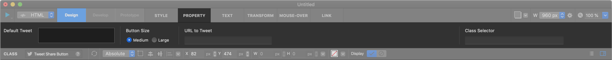

With Tweet Share Button widget, you can add **Share to Tweeter Button** in your project. (No Resize)

**Property**

* Child : Invalid
* Link  : Valid
* Scroll Animator : Valid
* Background Image : Valid
* Backend Ellipsis : Invalid

----------

Facebook Like Button
-----------------------

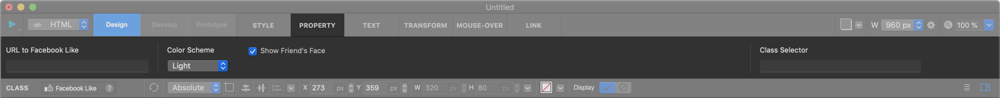

With Facebook Like Button widget, you can add **Share to Facebook Button** in your project. (No Resize)

**Property**

* Child : Invalid
* Link  : Valid
* Scroll Animator : Valid
* Background Image : Valid
* Backend Ellipsis : Invalid

----------

.. image:: resource/widget/IUCenterBox.png

Centered Box
--------------

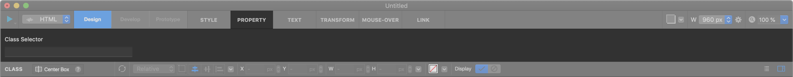

Centered Box widget makes horizontal centered layout to Section. Centered Box widget is added into section automatically, but you can remove this widget. (No resize)

**Property**

* Child : Invalid
* Link  : Valid
* Scroll Animator : Valid
* Background Image : Valid
* Backend Ellipsis : Invalid

----------

.. image:: resource/widget/IUProgressBar.png

Progress Bar
-------------

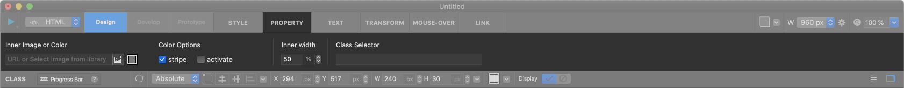

Progress Bar widget displays a progress bar. If you want draw certain status with bar elements, add this widget in your project.

**Property**

* Child : Invalid
* Link  : Valid
* Scroll Animator : Valid
* Background Image : Invalid
* Backend Ellipsis : Invalid

----------

.. image:: resource/widget/IUSVG.png

SVG (Scalable Vector Graphics)
----------------------------------

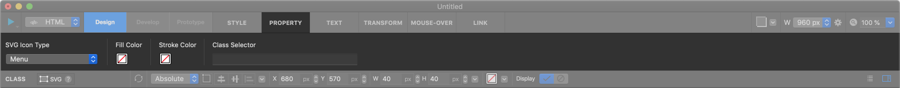

SVG widget displays Scalable Vector Graphics. You can select simple SVG form, or input custom svg code whatever you want.

**Property**

* Child : Invalid
* Link  : Valid
* Scroll Animator : Valid
* Background Image : Invalid
* Backend Ellipsis : Invalid

----------
