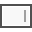
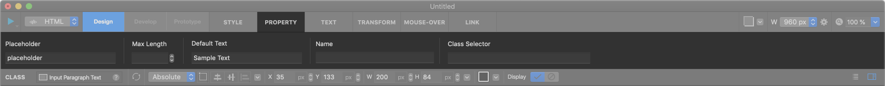
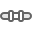

Programming Widget
============

-----------

.. image:: resource/widget/PGForm.png

Form
----------

Form widget is a container for programming widgets which is generated to <form> tag. If you want to use programming widgets, you must to add Form widget in your project.

**Property**

* Child : Valid
* Link  : Invalid
* Scroll Animator : Valid
* Background Image : Valid
* Backend Ellipsis : Invalid

----------

.. image:: resource/widget/PGTextField.png

Input Text
----------

Input Text widget is a textfield which is generated to <input> tag (type : text).

**Property**

* Child : Invalid
* Link  : Valid
* Scroll Animator : Valid
* Background Image : Valid
* Backend Ellipsis : Invalid

----------

Input Paragraph Text
--------------------

Input Paragrapth Text widget is a textfield which is generated to <textarea> tag.

**Property**

* Child : Invalid
* Link  : Valid
* Scroll Animator : Valid
* Background Image : Valid
* Backend Ellipsis : Invalid

----------

.. image:: resource/widget/PGSelect.png

Select
----------

Select widget is a select button which is generated to <select> tag. If you want to make select button, add this widget into Form widget.

**Property**

* Child : Invalid
* Link  : Valid
* Scroll Animator : Valid
* Background Image : Valid
* Backend Ellipsis : Invalid

----------

.. image:: resource/widget/PGHTML.png

HTML (Hyper Text Markup Language)
------------------------------------

HTML widget is a code container which is generated to **custom html tag** (e.g. <style>, <script>, etc, ...). You can make custom widget by input custom html code into HTML widget.

**Property**

* Child : Invalid
* Link  : Invalid
* Scroll Animator : Valid
* Background Image : Valid
* Backend Ellipsis : Invalid

----------

Collection
------------

Collection widget can import multiple Composition widgets. If you want to make collection view with compositions, you can create collection view with Collection widget.

**Property**

* Child : Invalid
* Link  : Valid
* Scroll Animator : Valid
* Background Image : Valid
* Backend Ellipsis : Invalid

----------

.. image:: resource/widget/PGPageLinkSet.png

Page Number Set
----------------

Page Number Set widget displays page links that usually placed bottom of Collection.

**Property**

* Child : Invalid
* Link  : Valid
* Scroll Animator : Valid
* Background Image : Valid
* Backend Ellipsis : Invalid

----------

.. image:: resource/widget/PGCheckBox.png

Checkbox
----------

Checkbox widget displays checkbox which is generated to <input> tag (type:checkbox).

**Property**

* Child : Invalid
* Link  : Valid
* Scroll Animator : Valid
* Background Image : Invalid
* Backend Ellipsis : Invalid

----------

.. image:: resource/widget/PGRadioButton.png

Radio Button
--------------

Radio Button widget displays radio button which is generated to <input> tag (type:radio).

**Property**

* Child : Invalid
* Link  : Valid
* Scroll Animator : Valid
* Background Image : Invalid
* Backend Ellipsis : Invalid

----------

.. image:: resource/widget/PGButton.png

Button
----------

Button widget displays button which is generated to <input> tag (type:default / reset / submit).

**Property**

* Child : Invalid
* Link  : Invalid
* Scroll Animator : Valid
* Background Image : Valid
* Backend Ellipsis : Invalid

----------

.. image:: resource/widget/PGFileUpload.png

File Upload
------------

File Upload widget displays file upload interface which is generated <input> tag (type:file).

**Property**

* Child : Invalid
* Link  : Invalid
* Scroll Animator : Valid
* Background Image : Invalid
* Backend Ellipsis : Invalid

----------

.. image:: resource/widget/PGSwitch.png

Switch
----------

Switch widget displays toggle button which is generated to <input> tag (type:checkbox), and contains two switch items.

**Property**

* Child : Invalid
* Link  : Invalid
* Scroll Animator : Valid
* Background Image : Invalid
* Backend Ellipsis : Invalid

----------

.. image:: resource/widget/PGFlipSwitch.png

Flip Switch
-------------

Flip Switch widget displays sliding switch which is generated to <input> tag (type:checkbox).

**Property**

* Child : Invalid
* Link  : Invalid
* Scroll Animator : Valid
* Background Image : Invalid
* Backend Ellipsis : Invalid

----------

.. image:: resource/widget/PGSlide.png

Slider
----------

Slider widget displays slider interface. You can change value by dragging slide pointer. (Or type a number to value)

**Property**

* Child : Invalid
* Link  : Invalid
* Scroll Animator : Valid
* Background Image : Invalid
* Backend Ellipsis : Invalid

----------

Range Slider
------------

Range Slider widget displays range slider interface. You can change range vaule by dragging slide pointers. (Or type a number to value)

**Property**

* Child : Invalid
* Link  : Invalid
* Scroll Animator : Valid
* Background Image : Invalid
* Backend Ellipsis : Invalid

----------
