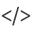

Programming Widget
============

Form
----------

.. image:: resource/widget/PGForm.png

.. thumbnail:: resource_new/form.png

Form widget is a container for programming widgets which is generated to :code:`<form>` tag.
If you want to use programming widgets, you must to add Form widget in your project.

**Property**

* Child : Valid
* Link  : Invalid
* Scroll Animator : Valid
* Background Image : Valid
* Backend Ellipsis : Invalid

Input Text
----------

.. thumbnail:: resource_new/input_text.png

Input Text widget is a textfield which is generated to :code:`<input>` tag (type : text).

**Property**

* Child : Invalid
* Link  : Valid
* Scroll Animator : Valid
* Background Image : Valid
* Backend Ellipsis : Invalid

Input Paragraph Text
--------------------

.. image:: resource/widget/PGTextView.png

.. thumbnail:: resource_new/input_paragraph.png

Input Paragraph Text widget is a textfield which is generated to :code:`<textarea>` tag.

**Property**

* Child : Invalid
* Link  : Valid
* Scroll Animator : Valid
* Background Image : Valid
* Backend Ellipsis : Invalid

Select
----------

.. image:: resource/widget/PGSelect.png

.. thumbnail:: resource_new/select.png

Select widget is a select button which is generated to <select> tag.
If you want to make select button, add this widget into Form widget.

**Property**

* Child : Invalid
* Link  : Valid
* Scroll Animator : Valid
* Background Image : Valid
* Backend Ellipsis : Invalid

HTML (Hyper Text Markup Language)
------------------------------------

.. thumbnail:: resource_new/html.png

HTML widget is a code container which is generated to **custom html tag**
(e.g. :code:`<style>`, :code:`<script>`, etc, ...). You can make custom widget
by input custom html code into HTML widget.

**Property**

* Child : Invalid
* Link  : Invalid
* Scroll Animator : Valid
* Background Image : Valid
* Backend Ellipsis : Invalid

Collection
------------

.. image:: resource/widget/PGCollection.png

.. thumbnail:: resource_new/collection.png

Collection widget can import multiple Composition widgets.
If you want to make collection view with compositions,
you can create collection view with Collection widget.

**Property**

* Child : Invalid
* Link  : Valid
* Scroll Animator : Valid
* Background Image : Valid
* Backend Ellipsis : Invalid

Page Number Set
----------------

.. image:: resource/widget/PGPageLinkSet.png

.. thumbnail:: resource_new/page_numb.png

Page Number Set widget displays page links that usually placed bottom of Collection.

**Property**

* Child : Invalid
* Link  : Valid
* Scroll Animator : Valid
* Background Image : Valid
* Backend Ellipsis : Invalid

Checkbox
----------

.. thumbnail:: resource_new/checkbox.png

Checkbox widget displays checkbox which is generated to :code:`<input>` tag (type:checkbox).

**Property**

* Child : Invalid
* Link  : Valid
* Scroll Animator : Valid
* Background Image : Invalid
* Backend Ellipsis : Invalid

Radio Button
--------------

.. image:: resource/widget/PGRadioButton.png

.. thumbnail:: resource_new/radio_btn.png

Radio Button widget displays radio button which is generated to :code:`<input>` tag (type:radio).

**Property**

* Child : Invalid
* Link  : Valid
* Scroll Animator : Valid
* Background Image : Invalid
* Backend Ellipsis : Invalid

Button
----------

.. image:: resource/widget/PGButton.png

.. thumbnail:: resource_new/button.png

Button widget displays button which is generated to :code:`<input>` tag (type:default / reset / submit).

**Property**

* Child : Invalid
* Link  : Invalid
* Scroll Animator : Valid
* Background Image : Valid
* Backend Ellipsis : Invalid

File Upload
------------

.. image:: resource/widget/PGFileUpload.png

.. thumbnail:: resource_new/file_upload.png

File Upload widget displays file upload interface which is generated :code:`<input>` tag (type:file).

**Property**

* Child : Invalid
* Link  : Invalid
* Scroll Animator : Valid
* Background Image : Invalid
* Backend Ellipsis : Invalid

Switch
----------

.. thumbnail:: resource_new/switch.png

Switch widget displays toggle button which is generated
to :code:`<input>` tag (type:checkbox), and contains two switch items.

**Property**

* Child : Invalid
* Link  : Invalid
* Scroll Animator : Valid
* Background Image : Invalid
* Backend Ellipsis : Invalid

Flip Switch
-------------

.. image:: resource/widget/PGFlipSwitch.png

.. thumbnail:: resource_new/flip_switch.png

Flip Switch widget displays sliding switch which is generated to :code:`<input>` tag (type:checkbox).

**Property**

* Child : Invalid
* Link  : Invalid
* Scroll Animator : Valid
* Background Image : Invalid
* Backend Ellipsis : Invalid

Slider
----------

.. thumbnail:: resource_new/slider.png

Slider widget displays slider interface.
You can change value by dragging slide pointer.
(Or type a number to value)

**Property**

* Child : Invalid
* Link  : Invalid
* Scroll Animator : Valid
* Background Image : Invalid
* Backend Ellipsis : Invalid

Range Slider
------------

.. image:: resource/widget/PGRangeSlide.png

.. thumbnail:: resource_new/range_slider.png

Range Slider widget displays range slider interface.
You can change range value by dragging slide pointers. (Or type a number to value)

**Property**

* Child : Invalid
* Link  : Invalid
* Scroll Animator : Valid
* Background Image : Invalid
* Backend Ellipsis : Invalid
