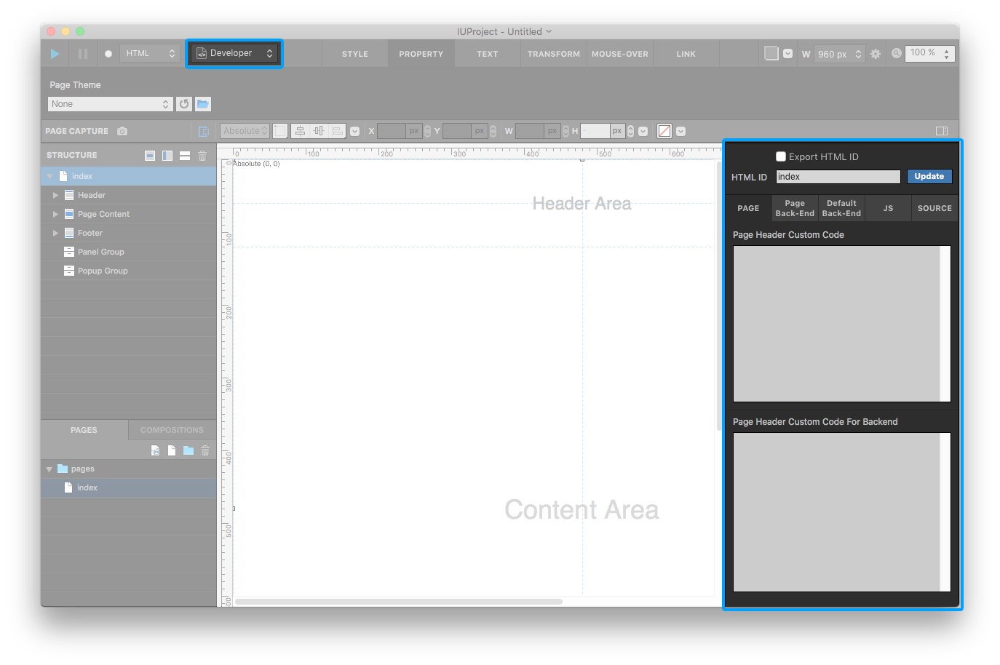

.. _HTML ID : #HTML ID
.. _Custom Code : #Custom Code

Developer Mode
=======================

In Top toolbar, yo can switch to **Developer Mode ** by clickig ``Mode Switch Button``.

In Developer mode **Code Panel** will be shown. It consist of `HTML ID`_ / `Cusom Code`_ area.

----------

HTML ID
-----------------------

You can check and change HTML ID here. There is **Export HTML ID** check box. In ``Preference - Project``, you can set **Export HTML ID Option**. (Always include or Optimize and customize)

----------

Custom Code
-----------------------

You can write back-end, custom css, script code. The tab composition differ between widget and project type.

