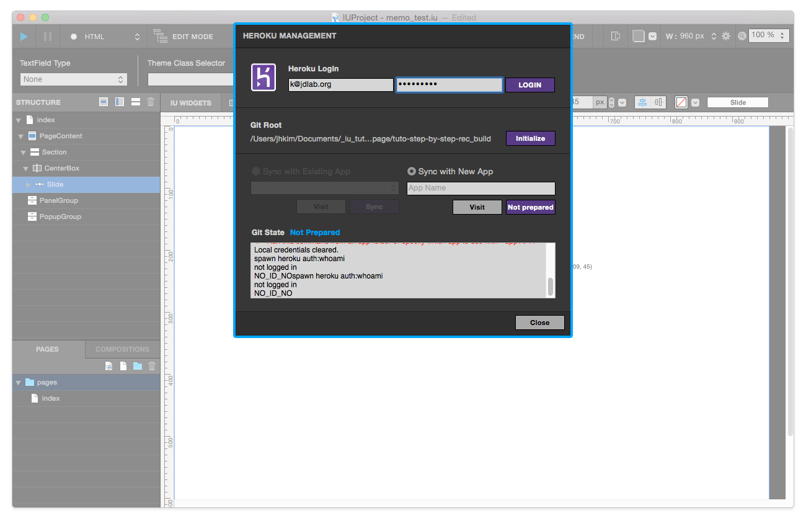

.. _Tutorial 203 - Heroku : http://tutorial.iueditor.org/en/tuto02-magazine-part3(en).html

Heroku Management
==========================

In order to upload the Built Files to your Heroku Server, open the **Heroku Management Panel** (Project > Upload to Heroku menu). 
With this panel, you can upload your project to the server. Try out a tutorial below :

`Tutorial 203 - Heroku`_

