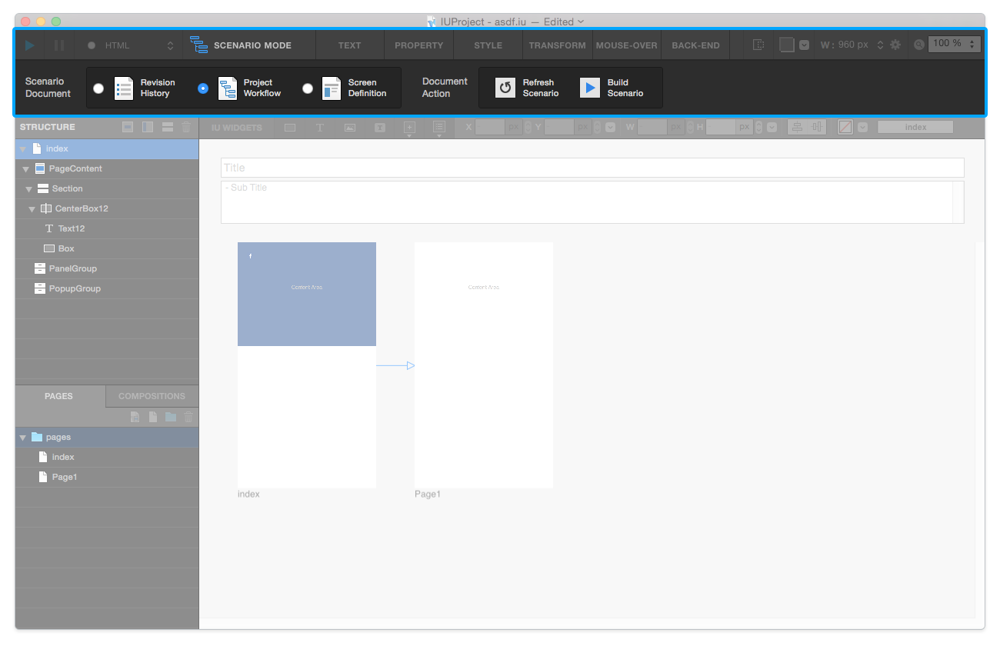

Scenario Mode
=======================

From the toolbar at the top, you can switch from **Edit Mode** to **Scenario Mode** by clicking ``Scenario / Edit Mode Switch Button``.

Scenario Mode offers :ref:`Revision History` / :ref:`Project Workflow` / :ref:`Screen Definition` page. You can refresh scenario by clicking ``Refresh Scenario Button`` and can build **HTML Scenario** by clicking ``Document Build Button`` .

----------

Revision History
-----------------------

Displays **Revision History** about the current project. You can add or change the history.

----------

Project Workflow
-------------------------------

Displays **Workflow (Page Links)** about the current project.

----------

Screen Definition
-------------------------------

Displays **Screen Definition** about the selected page. You can add or change content in screen description or exception area.
