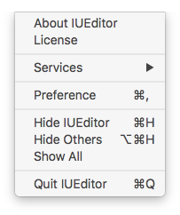
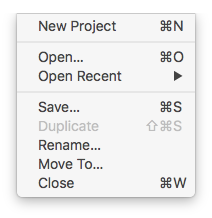
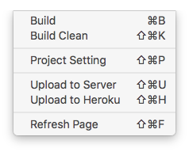
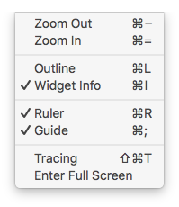
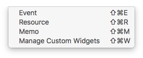
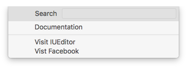

.. _시나리오 모드 Scenario Mode : ./advanced_scenario_mode.html

Menu
==========================

Description about IUEditor Menu Bar.
----------

IUEditor
----------------------------

* ``About IUEditor`` : Show IUEditor's version info.
* ``License`` : Shhow IUEditor's license info. You can enter license key and visit license page.
* ``Preference`` : Open IUeditor preference window. (링크)

----------

File
----------------------------

* ``New Project`` : Open New Project window.
* ``Open`` : Open Finder to find IU Project file to open.
* ``Open Recent`` : Open recent IU Project file.
* ``Save`` : Save current project.
* ``Duplicate`` : Duplicate project an current path.
* ``Rename`` : Edit project name.
* ``Move To`` : Change current project's path .
* ``Close`` : Close current project.

----------

Project
----------------------------

* ``Build`` : Generates HTML & CSS & JS files based on IU Project. 
* ``Build Clean`` : Clean build data. It can fix program error.
* ``Project Setting`` : Opens Project Setting panel. (링크)
* ``Upload to Server`` : Opens Upload to Server panel. (링크)
* ``Upload to Heroku`` : Opens Heroku Management panel. (링크)
* ``Reresh Page`` : Refresh current page. It can fix program error.

----------

View
----------------------------

* ``ZoomOut`` : Zoom In stage.
* ``ZoomIn`` : Zoom Out stage.
* ``Outline`` : Show or hide outline of widgets in canvas.
* ``Widget Info`` : Show or hide information of widgets in canvas.
* ``Ruler`` : Show or hide ruler on canvas.
* ``Guide`` : Show or hide guide on canvas.
* ``Tracing`` : Show or hide tracing image on canvas.

----------

Window
----------------------------

* ``Event`` : Opens Event panel. (링크)
* ``Resource`` : Opens Resource panel. (링크)
* ``Memo`` : Opens Memo panel. (링크)
* ``Manage Custom Widgets`` : Opens Custom Widget Management panel. (링크)

----------

Help
----------------------------

* ``Search`` : Search IUEditor function.
* ``Documentation`` : Open IUEditor Manual page in brower.
* ``Visit IUEditor`` : Open IUEditor Homepage page in brower.
* ``Visit Facebook`` : Open IUEditor Facebook page in brower.

