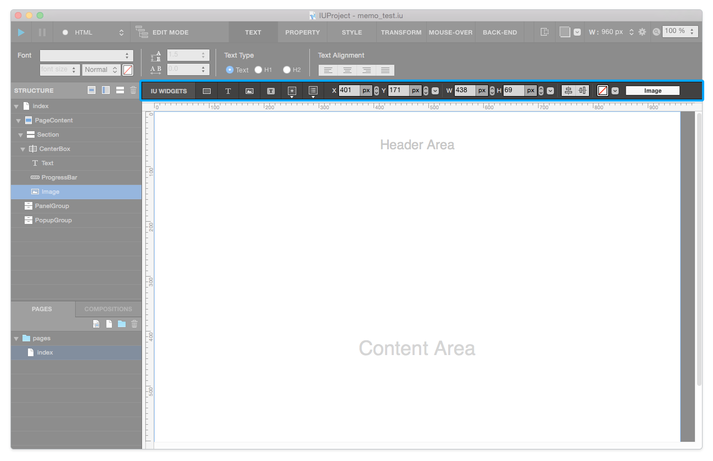

.. _Go To Widget Property: ./widget_basic.html

.. _Widgets : #id1
.. _Position : #id2
.. _Frame : #id3
.. _Align : #id4
.. _Background-Color : #id5

Middle Toolbar
==============

Middle Toolbar is placed top of Canvas and contains `Widgets`_ / `Position`_ / `Frame`_ / `Align`_ / `Background-Color`_ area.

----------

Widgets
-------

Widget area consists of Widgets ( **Basic , Complex , Programming** ). 

You can add widget to canvas by following steps below :

1. Activate widget by clicking widget icons.
2. Click & drag on IUEditor's canvas.

`Go To Widget Property`_

----------

Position
--------

Position area consists of **input fields & stepper for X & Y position** . 

* ``X posiition input field & Stepper`` : You can change **X** value by typing value into textfield or clicking stepper. (px or %)
* ``Y posiition input field & Stepper`` : You can change **Y** value by typing value into textfield or clicking stepper. (px or %)
* ``Position Setting Popup`` : You can change **position, overflow, z-index** properties.

----------

Frame
-----

Frame area consists of **input fields & stepper for width & height value** . 

* ``Width input field & Stepper`` : You can change **Width** value by typing value into textfield or clicking stepper. (px or %)
* ``Height input field & Stepper`` : You can change **Height** value by typing value into textfield or clicking stepper. (px or %)
* ``Frame Setting Popup`` : You can change **min-width , max-width , min-height , max-height , calc-width , calc-height** properties.

----------

Align
-----

Align area consists of **set vertical or horizontal align** buttons.

.. note:: **set vertical align** will apply only **Position : Absolute** widgets.

----------

Background Color
----------------

Background Color area consists of **set background color button, set gradient popup** . You can change background color or gradient to selected widget.
