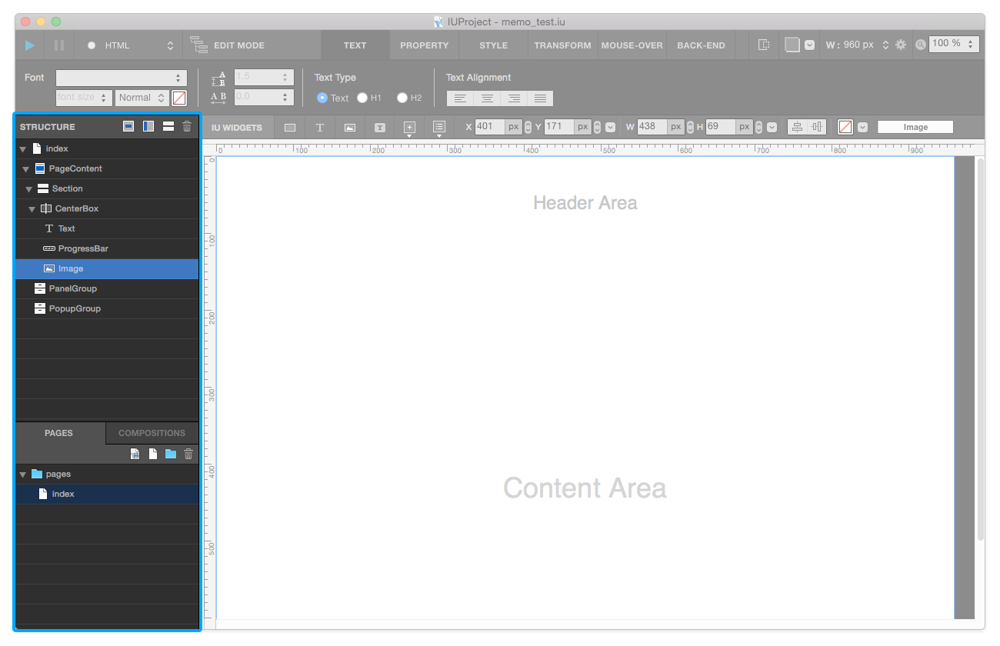

.. _Structure : #id1
.. _Page : #id2
.. _Composition : #id3

Navigation
==========

Navigation area is placed left-side of Canvas, and contains `Structure`_ , `Page`_ , `Composition`_ area.

----------

Structure
---------

Structure area consists of current page's structure. ( **section , header , footer , page content , widget** , ...)

You can **reorder, remove, rename, and hide** widget in structure.

* ``Add New Popup`` : Add a Popup widget into current page.
* ``Add New Panel`` : Add a panel widget into current page.
* ``Add New Section`` : Add a section into page content.
* ``Delete`` : Delete selected element.

----------

Page
-------

Page area consists of current project's page list. You can **add, remove, and rename page & group** .

* ``Add New Custom Page Button`` : Adds new custom page.
* ``Add New Page Button`` : Adds new page.
* ``Add New Group Button`` : Adds new group.
* ``Delete Button`` : Delete selected page or group.

----------

Composition
------------

Composition area consists of current project's composition list. You can *add, remove, and rename composition & group** .

* ``Add New Custom Composition Button`` : Adds new custom composition.
* ``Add New Composition Button`` : Adds new composition.
* ``Add New Group Button`` : Adds new group.
* ``Delete Button`` : Delete selected composition or group.

-----------

References
----------

*How to rename widget, page, and group*

1. Select object(widget, page, or group) that you want to rename
2. Press **Enter or Tab key**
3. Type new name as you want
4. Press **Enter Key**

..note :: You can not use these name : **id / ifdef / default** 

