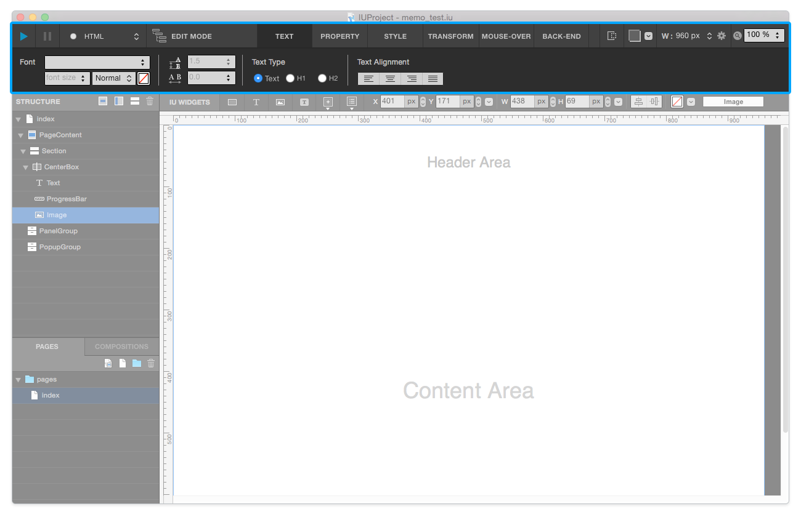
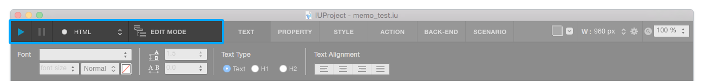
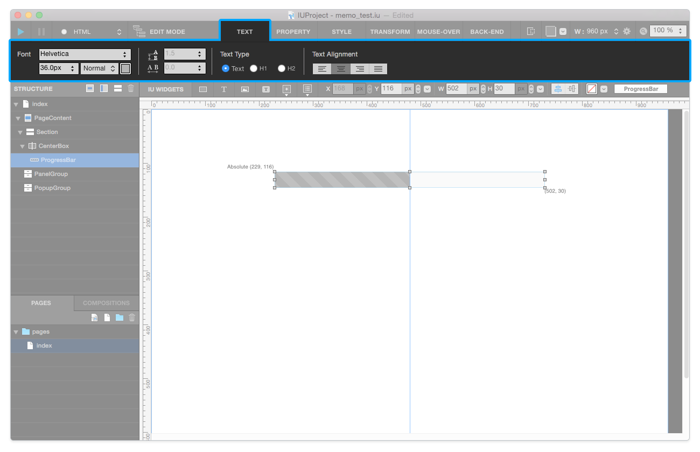
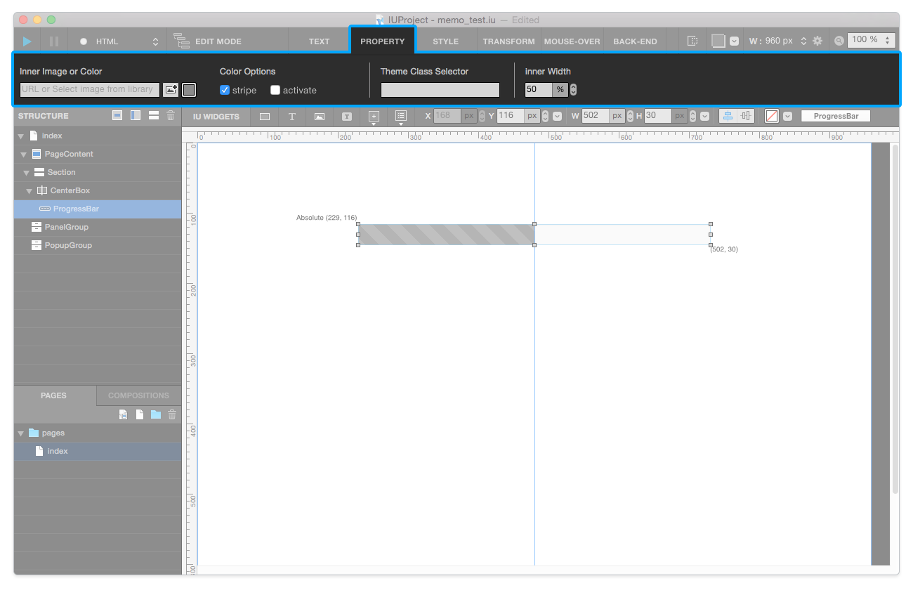
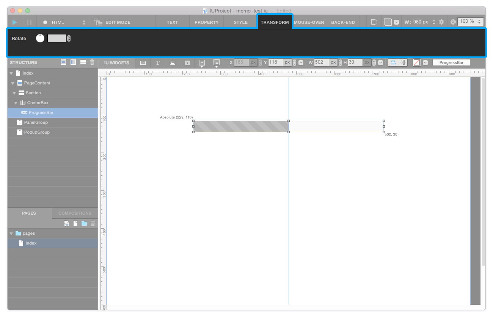
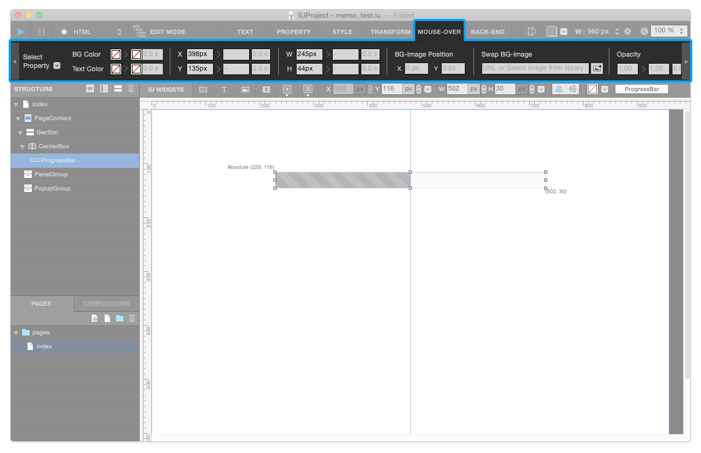
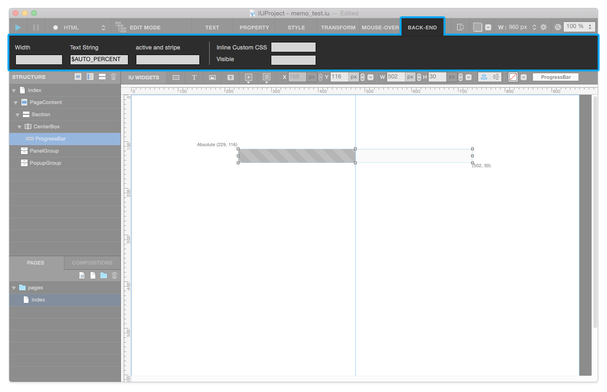
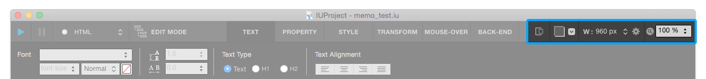

.. _Command : #id1
.. _Tab Menu : #id2
.. _Stage : #id3
.. _Scenario Mode : ./advanced_scenario_mode.html

Top Toolbar
===========

**Top Toolbar** contains `Command`_ / `Tab Menu`_ / `Stage`_ area. 

----------

Command
------------------------------

Command Area consists of project-level features.

* ``Build Button`` : Generates  HTML & CSS & JS files based on IU Project.
* ``Server Stop Button`` : Stops localhost server.
* ``Select Build-Type Button`` : Select Build-Type to Build. (HTML or Django)
* ``Scenario / Edit Mode Toggle Button`` : Switches Edit Mode to `Scenario Mode`_ . (Also works reverse.)

----------

Tab Menu
--------

Tab Menu area consists of 6 tabs - Text, Property, Style, Transform, Mouse-Over, and Back-End.

* ``Text Tab`` : In Text Tab, you can modify **Font-family / Font-weight / Font-size / Line-height / Heading / Font-color / Font-align** .

* ``Property Tab`` : In Property Tab, you can set & change properties of each Widgets. Each Widget has individual property options.

.. image:: resource/iu_manual_top_toolbar_tab03_style.png

* ``Style Tab`` : In Style Tab, you can modify **Radius / Border / Box-Shadow / Opacity / Background-Image** .

* ``Transform Tab`` : In Transform Tab, you can modify **Rotation** property.

* ``Mouse-Over Tab`` : In Mouse-Over Tab, you can add Mouse-Over actions to each widgets. (e.g. **BG-color, Text-Color, X-position, Y-position, width, height, BG-image position, ...** )

* ``Back-End Tab`` : In Back-end Tab, you can insert **Variables** to certain widget. (This feature available only on **Django Project** .)

----------

Stage
----------

* ``Fixed Widget Show / Hide Button`` : Switches show to hide **Fixed Widgets** .
* ``Tracing`` : Adds virtual background image into your canvas, so that you can create design quickly.
* ``Page Setting`` : Modifies current page's **Page Width** and **Media Query** .
* ``Zoom`` : Applies Zoom-In / Out to IUEditor's Canvas.

