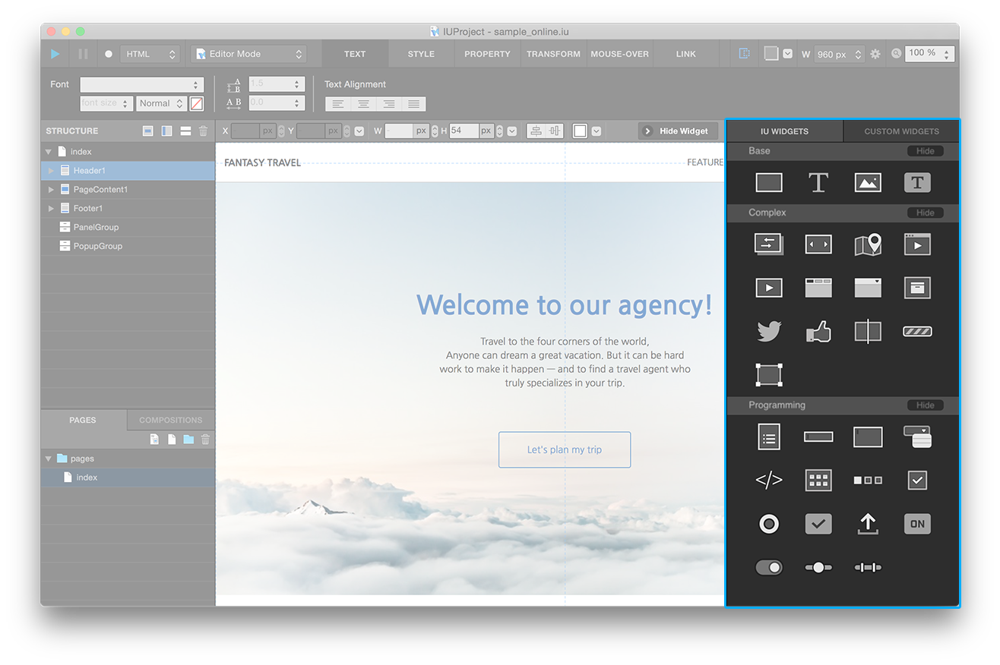
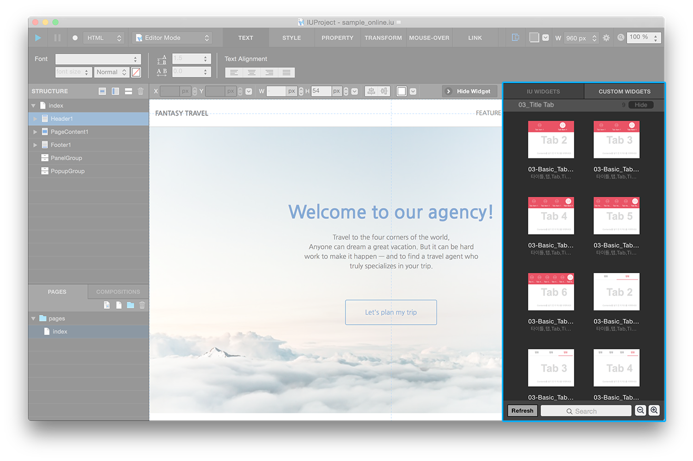

.. _Go To Widget Property: ./widget_basic.html
.. _Go To Manage Custom Widgets Panel: ./panel_management_widget.html
.. _IU Widget: #iu-widgets
.. _Custom Widget: #custom-widgets
.. _Manage Custom Widget: ./panel_management_widget.html 

Widget Panel
==========

Widget toolbar is at the right side of window. Open and close **Wiget Panel** with **Show/Hide Widget Button** in the middle tool bar. Widget panel consist of `IU Widget`_ / `Custom Widget`_ tab.

----------

IU Widget
----------------

In IU WIDGET tab, all widgets availabel in IUEditor will shown. Fundamentally **Box / Text / Image / Static Image / Cell** widgets are offered and supports various widgets can used in web page. Consist of Base, Complex, Programming groups. You can see derailed information by **second click** widgets.

`Go To Widget Property`_

----------

Custom Widget
----------------

In CUSTOM WIDGETS tab, custom widgets imported by **Import Button** will be shown. It devided into custom widget groups. You can add custom widget on canvas by **drag and drop** or **double click** widget. You can see derailed information by **second click** widgets. You can edit information of custom widget in ``Manage Custom Widget``_ window.  

* ``Refresh Button`` : Updates custom widget library.
* ``earch Field`` : Search custom widget library by name or tag.
* ``Zoom in/Zoom out Button`` : Zoom in or out custom widget library.

`Go To Manage Custom Widgets Panel`_  

