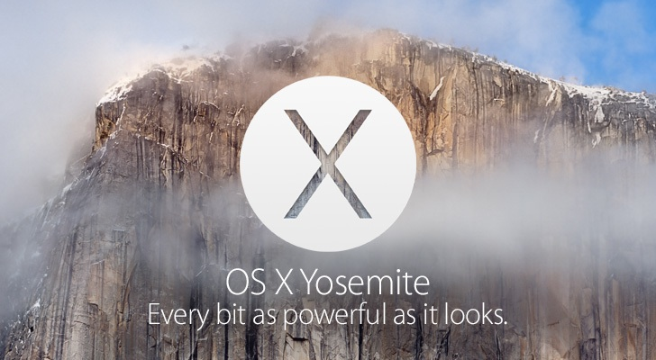

Environment
===========

**IUEditor** operates only on Mac OS X - Yosemite. (10.10.a +) And you have to install Git and Heroku Toolbelt.(Heroku account required)

* Git Download : http://git-scm.com/downloads
* Heroku Toolbelt : https://toolbelt.heroku.com
