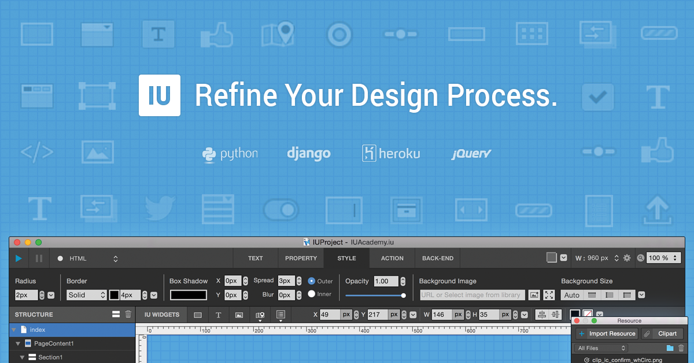

===============
IUEditor Manual
===============

Welcome to **IUEditor** Manual.

You can download **IUEditor** from website below.

* IUEditor Homepage : http://iueditor.org
* IUEditor Facebook Page (Korean): https://www.facebook.com/iueditor

.. note:: Currently IUEditor offers Free User License until the end of 2015. Anyone can use IUEditor but only for personal and non-commercial project.

---------

.. toctree::
   :maxdepth: 2
   :caption: Introduction
   
   intro_what_is_iueditor
   intro_environment
   
   
.. toctree::
   :maxdepth: 2
   :caption: Basic Feature
   
   basic_top_toolbar
   basic_middle_toolbar
   basic_widget_panel
   basic_navigation
   basic_canvas
   
   
.. toctree::
   :maxdepth: 2
   :caption: Advanced Feature
   
   advanced_developer_mode
   advanced_scenario_mode
   advanced_prototype_mode
   advanced_heroku
   
   
.. toctree::
   :maxdepth: 2
   :caption: Panel
      
   panel_resource
   panel_event
   panel_memo
   panel_import_widget
   panel_export_widget

   
.. toctree::
   :maxdepth: 2
   :caption: Project
   
   project_type
   project_setting

   
.. toctree::
   :maxdepth: 2
   :caption: Sheet
   
   sheet_page
   sheet_composition
   
   
.. toctree::
   :maxdepth: 2
   :caption: Widget
   
   widget_basic
   widget_complex
   widget_programming
   
 
  
.. toctree::
   :maxdepth: 2
   :caption: Known Bugs 
      
   known_bug_list
   
   
.. toctree::
   :maxdepth: 2
   :caption: Tutorials
   
   tutorial
   

.. toctree::
   :maxdepth: 2
   :caption: Appendix
   
   appendix_templates
   appendix_shortcut
   appendix_dict
