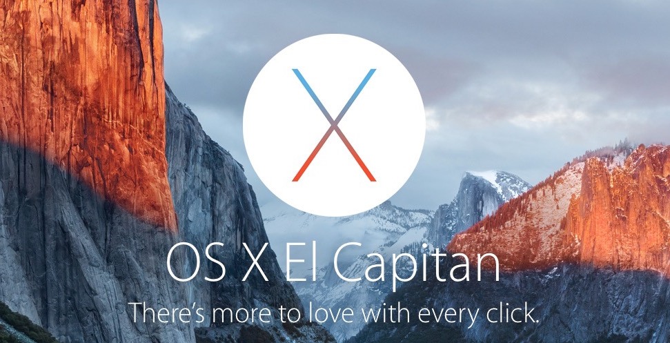

Environment
===========

**IUEditor** operates only on Mac OS X - Yosemite & El Capitan. (10.10.a +) And you have to install **Git** & **Heroku Toolbelt** (Heroku account also required)

Browser support : Chrome, Safari, Firefox, Opera - current / IE 9+

* Git Download : http://git-scm.com/downloads
* Heroku Toolbelt : https://toolbelt.heroku.com
