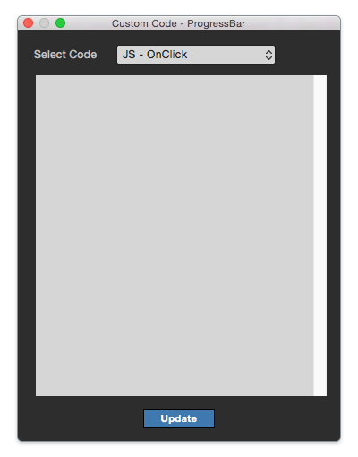

Cutsom Code Panel
==============================

When you run **View > Custom Code (⇧⌘C)** menu, Custom Code Panel will be shown. You can write and save code. 

.. note :: Custom Code Panel contains JavaScript (onClick / onChange / onLoad), HTML (inner code), SVG code.

