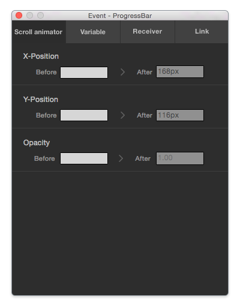
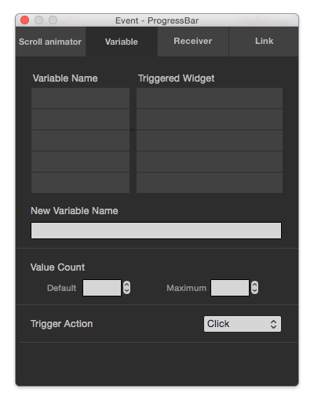
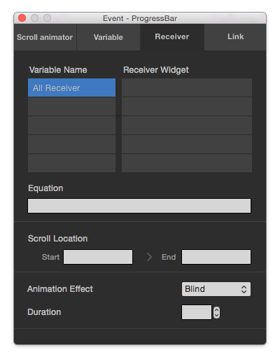
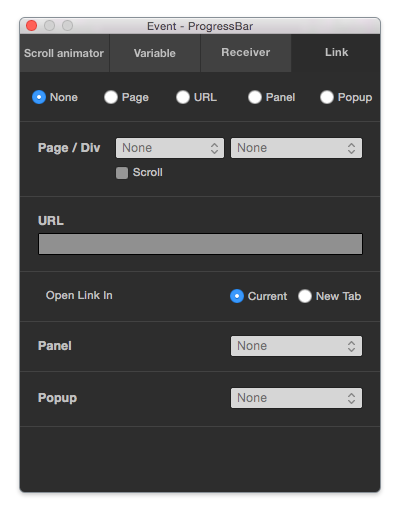

이벤트 패널 Event Panel
====================

이벤트 패널은 아이유에디터 메뉴 View > Event 항목을 활성화 시키면 등장합니다. 스크롤 애니메이터, 베리에이블 트리거 같은 이벤트를 추가할 수 있습니다.

----------

스크롤 애니메이터 Scroll Animator
--------
세로로 긴 웹페이지를 스크롤 하게 될 경우, 선택한 요소들에 대한 애니메이션 이벤트를 추가합니다. 스크롤 애니메이터는 해당요소가 브라우저 중앙에 근접할수록 After값에 가까워집니다. 그래서 페이지를 스크롤해서 해당 요소에 포커싱 될 때 Before 값에서 After 값으로 조정됩니다.

* ``X-Position`` : X 위치 값에 대한 애니메이션을 추가합니다.
* ``Y-Position`` : Y 위치 값에 대한 애니메이션을 추가합니다.
* ``Opacity`` : Opacity 투명도 값에 대한 애니메이션을 추가합니다.

----------

베리에이블 Variable
----------------

선택된 위젯에 특정액션이 발생되도록 (롤오버 or 클릭) 변수값과 옵션을 설정합니다.

* ``Variable Name`` : 현재 페이지에 설정 된 모든 Variable 리스트를 보여줍니다. row를 클릭하면 해당 Variable을 사용하는 Triggered Widget 리스트를 볼 수 있습니다. Variable을 사용하는 Widget이 없으면 Variable Name 리스트에서 삭제 됩니다.

* ``Triggered Widget`` : Variable Name 에서 선택한 Variable을 사용하는 Triggered Widget 리스트를 보여줍니다. row를 클릭하면 해당 위젯으로 포커스가 이동합니다. row를 선택한 후, delete키(키보드)를 누르거나 New Variable Name에서 삭제하면 Triggered Widget 리스트에서 삭제 됩니다.

* ``New Variable Name`` : 트리거의 변수값을 설정합니다. ID나 Name과 같은 역할을 합니다.

* ``Value Count`` : 트리거의 초기값과, 최대 몇 개의 리시버를 가질지 최대값을 설정합니다.

* ``Trigger Action`` : 마우스오버 또는 클릭 시 트리거가 동작하도록 설정합니다.

----------

리시버 Receiver
-------------

트리거메뉴에서 정의한 변수가 Equation의 조건과 일치하게 될 경우, 리시버가 설정된 위젯을 보여줍니다.

* ``Variable Name`` : 현재 페이지에 설정 된 모든 Variable 리스트를 보여줍니다. row를 클릭하면 해당 Variable을 사용하는 Receiver Widget 리스트를 볼 수 있습니다. 예를 들어, a라는 Variable을 선택하면 a==1, aa==1, 1==abc와 같은 a가 포함된 Equation을 갖는 위젯들을 보여줍니다. Variable을 사용하는 Widget이 없으면 Variable Name 리스트에서 삭제 됩니다.

* ``Receiver Widget`` : Variable Name 에서 선택한 Variable을 사용하는 Receiver Widget 리스트를 보여줍니다. row를 클릭하면 해당 위젯으로 포커스가 이동합니다. row를 선택한 후, delete키(키보드)를 누르거나 Eqation에서 삭제하면 Receiver Widget 리스트에서 삭제 됩니다.

* ``Equation`` : Trigger에서 지정한 변수에 대한 조건식을 지정합니다. 예시) a==1

* ``Scroll Location`` : Receiver 위젯의 Equation이 만족했을 때, 위젯이 보여지는 스크롤 위치를 지정하는 옵션입니다. 옵션을 지정하면 Start와 End사이에 스크롤이 위치했을 때에만 보여지고, 옵션을 지정하지 않으면 스크롤 위치와 상관없이 보여지게 됩니다.

* ``Animation Effect`` : Receiver 위젯이 보여질 때 나타나는 애니메이션 효과 입니다.

* ``Duration`` : Animation Effect가 실행되서 끝날 때 까지의 시간입니다. 예를 들어, 3.0s를 입력하면 Animation Effect가 3초동안 실행됩니다. 

----------

링크 Link
-------------

선택된 요소를 클릭했을 때 실행되는 링크를 설정합니다. 1개의 위젯 당 하나의 옵션만 선택할 수 있습니다.

* ``None`` : 링크를 연결하지 않습니다. (기본값)

* ``Page`` : 현재 아이유 프로젝트의 페이지 Page 또는 Div 로의 링크를 설정하여 줍니다.

* ``URL`` : 외부 URL 링크 주소를 설정하여 줍니다.

* ``Panel`` : 현재 아이유 프로젝트의 특정 패널 Panel 을 불러옵니다.

* ``Popup`` : 현재 아이유 프로젝트의 특정 팝업 Popup 을 불러옵니다.

