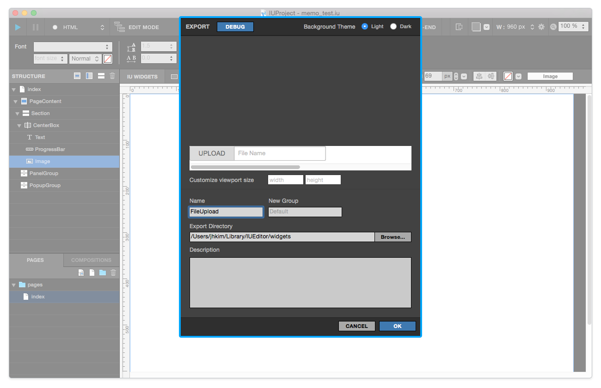

.. _Import Widget Panel : ./panel_import_widget.html
.. _Navigation > Page : ./basic_navigation.html#id2
.. _Navigation > Composition : ./basic_navigation.html#id3

.. _Export Widget : #export-widget-iuw
.. _Export Page : #export-page-iup
.. _Export Composition : #export-composition-iuc

Export Widget Panel
==============================

위젯 내보내기 패널은

* 스트럭쳐나 캔버스에서 특정 위젯을 선택하여 컨텍스트 메뉴 > `Export Widget`_ 실행
* 페이지를 선택하여 컨택스트 메뉴 > `Export Page`_ 실행
* 컴포지션을 선택하여 컨텍스트 메뉴 > `Export Composition`_ 실행

하여 불러올 수 있습니다. 

* ``Customize Viewport Size`` : 커스텀파일의 뷰포트를 원하는 사이즈로 조정합니다.
* ``Name`` : 커스텀 파일의 이름을 입력합니다.
* ``New Group`` : 커스텀 파일의 그룹을 입력합니다.
* ``Export Directory`` : 커스텀 파일을 내보낼 경로를 설정합니다.
* ``Description`` : 커스텀 파일에 설명을 입력합니다.

----------

Export Widget (.iuw)
-----------------------------

.. image:: resource/icon_IUW_128x128.png

위 1) 상황에서 내보내기 Export 기능을 실행 하면, 로컬디스크에는 ``커스텀위젯이름.iuw`` 파일이 생성됩니다. 이 파일은 `Import Widget Panel`_ 에서 불러온 후에 사용 가능합니다.

----------

Export Page (.iup)
-----------------------------

.. image:: resource/icon_IUP_128x128.png

위 2) 상황에서 내보내기 Export 기능을 실행 하면, 로컬디스크에는 ``커스텀페이지이름.iup`` 파일이 생성됩니다. 이 파일은 `Navigation > Page`_ 에서 ``커스텀 페이지 추가 버튼`` 으로 불러올 수 있습니다.

----------

Export Composition (.iuc)
-----------------------------

.. image:: resource/icon_IUC_128x128.png

위 3) 상황에서 내보내기 Export 기능을 실행 하면, 로컬디스크에는 ``커스텀위젯이름.iuc`` 파일이 생성됩니다. 이 파일은 `Navigation > Composition`_ 에서 ``커스텀 컴포지션 추가 버튼`` 으로 불러올 수 있습니다.