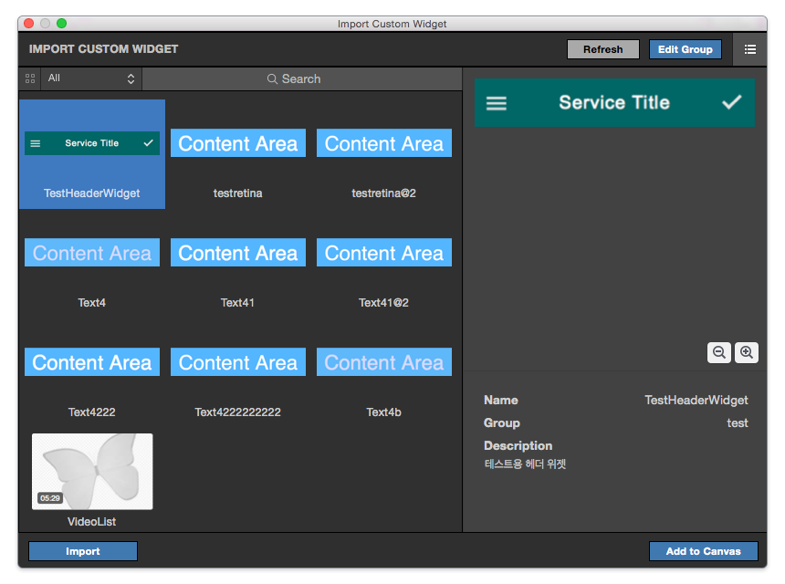

.. _Custom Widget List : #id1
.. _Custom Widget Info : #id2

Import Widget Panel
==================================

When you run **Project > Custom Widgets (⇧⌘W)** menu, Import Widget Panel will be shown. You can import custom widgets (.iuw) into this panel. This panel supports Grid / Table view in Widget list.
 

----------

Widget Group List
----------------------------

Widget Group List is placed at the left side of panel. You can browse `Custom Widget List`_ by selecting Group name.

----------

Custom Widget List
-------------------------------

Custom Widget List is placed at the center of panel.

* ``List / Grid View Toggle Button`` : Switches Grid & Table View.
* ``Search Bar`` : Searches by custom widget name.
* ``Import`` : Imports custom widget file(.iuw)
* ``Refresh`` : Refreshes current widget list.
* ``Open Folder`` : Opens custom widget folder.
* ``Widget Info Toggle Button`` : Show or Hide `Custom Widget Info`_ area.

----------

Custom Widget Info
------------------------------

Custom Widget Info is placed at the right side of panel.

* ``Preview`` : Shows preview of selected custom widget.
* ``Zoom In / Out`` : Zoonm In or Out on preview.
* ``Name`` : Displays name of selected custom widget.
* ``Group`` : Displays group of selected custom widget.
* ``Description`` : Displays description of selected custom widget.

