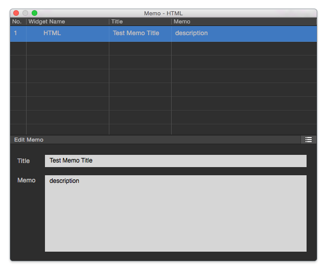

Memo Panel
====================

When you run **View > Memo (⇧⌘M)** menu, Memo Panel will be shown. You can add a memo to selected widget.

* ``Show / Hide Table Toggle Button`` : Open or Close Memo List area.
* ``Title`` : Adds title to selected memo.
* ``Memo`` : Adds memo to selected widget.

.. note:: In Memo List, you can modify Memo's **Number / Title / Memo** .