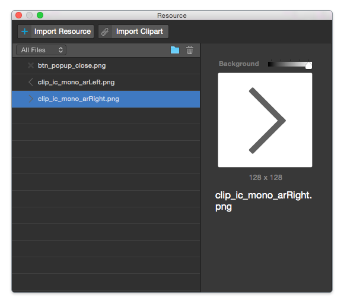
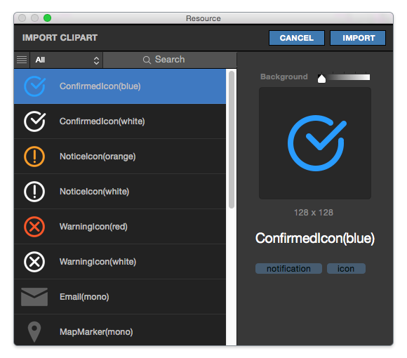

.. _Import Clipart : #id1

Resource Panel
=======================

When you run **View > Resource (⇧⌘R)** menu, Resource Panel will be shown.

You can import resources (image / video / clipart) into Resource Panel.

.. note :: Supported File Type : jpg / png / git / svg / mp4

* ``Import Resource Button`` : Imports resources from local disk.
* ``Import Clipart Button`` : Imports cliparts from `Import Clipart`_ .
* ``Resource Type Select Button`` : Sorts out files in Resource Panel by file type.
* ``Add New Folder Button`` : Adds new folder.
* ``Delete Button`` : Deletes selected file(s) or folder(s).

----------

Import Clipart 
---------------------------

You can import clipart images that supported by IUEditor.

* ``Import`` : Imports selected clipart(s)
* ``Cancel`` : Closes Clipart Panel.
* ``Grid / List View Change Button`` : Switches view type (List & Grid).
* ``Clipart Type Select Button`` : Sorts out clipart in Clipart Panel by tag.
* ``Search`` : Searches by filename.

----------

Resource Management Tips
----------------------------

* You can create groups and reorder resources.
* You can insert image resource to widget by drag & drop into target widget.
