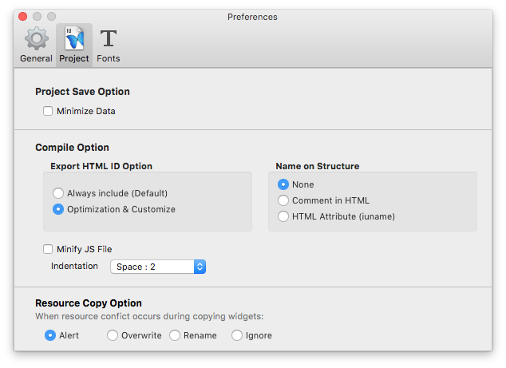
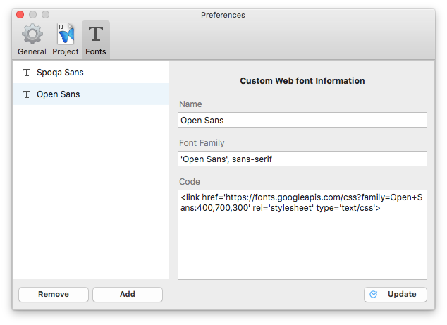

.. _Custom widget : ./panel_management_widget.html

Preference
=======================
Set IUEditor's service environment.

-------------

General
--------------------------

.. image:: resource/iu_manual_preference_general.png

* ``Select Tab Menu`` : Show or hide tab menus from top toolbar.
* ``Guide Line Color`` : Change guide line color. (View guideline : View > Guide ⌘;)

-------------

Project
--------------------------

* ``Project Save Option`` : Compress project's json file if 'Minimize Data' checkbox checked.
* ``Compile Option`` : 
  - ``Export HTML ID Option`` : Select whether contain HTML ID as default to all widget or customize.
  - ``Name on Structure`` : Select whether contain widget's name in html document or not.

* ``Resource Copy Option`` : Select how to do about multiple resources when ``Custom Widget``_ added on canvas.
* ``Widget Option`` : Select to contain centerbox in section as default .

-------------

Fonts
--------------------------

Add new webfont into font list.

