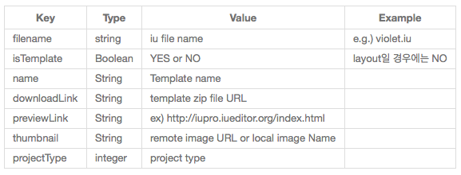
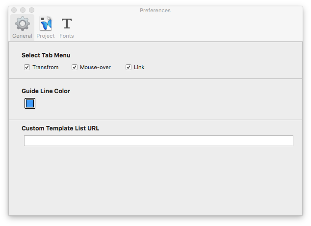

커스텀 템플릿 Custom Template
=======================

새프로젝트 만들기에 노출되는 템플릿 목록을 커스터마이즈 할 수 있습니다. 
커스텀 템플릿을 적용하기 위해서 아래 가이드를 따라 주세요.

----------

1. plist 만들기
-----------------------

내부에서 템플릿 리스트 구조는 plist 파일을 통하여 이루어지며 구조는 아래와 같습니다.

**plist 구조**

* ``1. isTemplate`` : 무조건 YES를 적어주시면 됩니다. (No는 내부에서만 사용하고 있습니다.)
* ``2. downLoadLink`` : 다운로드를 받을 수 있는 zip파일입니다.  download를 위해 iu파일이 zip파일로 묶어져 있어야 합니다.
* ``3. filename`` :  zip파일안의 iu파일 이름입니다.
* ``4. thumbnail`` : new document 화면에서 보이는 thumbnail입니다.
* ``5. previewLink`` : preview 버튼을 누르면 연결되는 화면입니다. 이미지 파일 혹은 실제 페이지로 구성되어 있습니다. 

**Project type**

* ``0`` : default project
* ``1`` : django project
* ``2`` : angular js project
* ``3`` : wordpress project

----------

2. 서버에 저장하기
-----------------------

1에서 만든 plist 파일을 내 서버에 저장합니다. plist의 url주소를 확인합니다.

----------

3. URL 입력
-----------------------

plist의 URL주소를 preference에 적용하면 다음 IUEditor실행부터 template이 반영된 모습을 확인할 수 있습니다.

