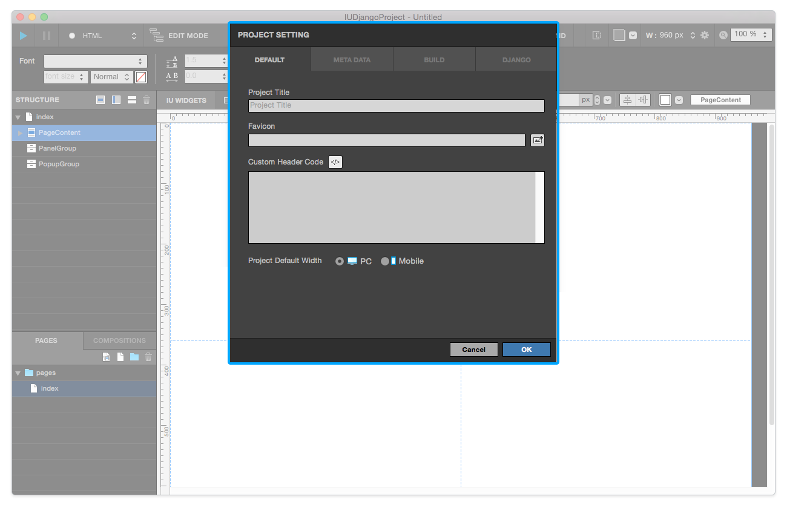
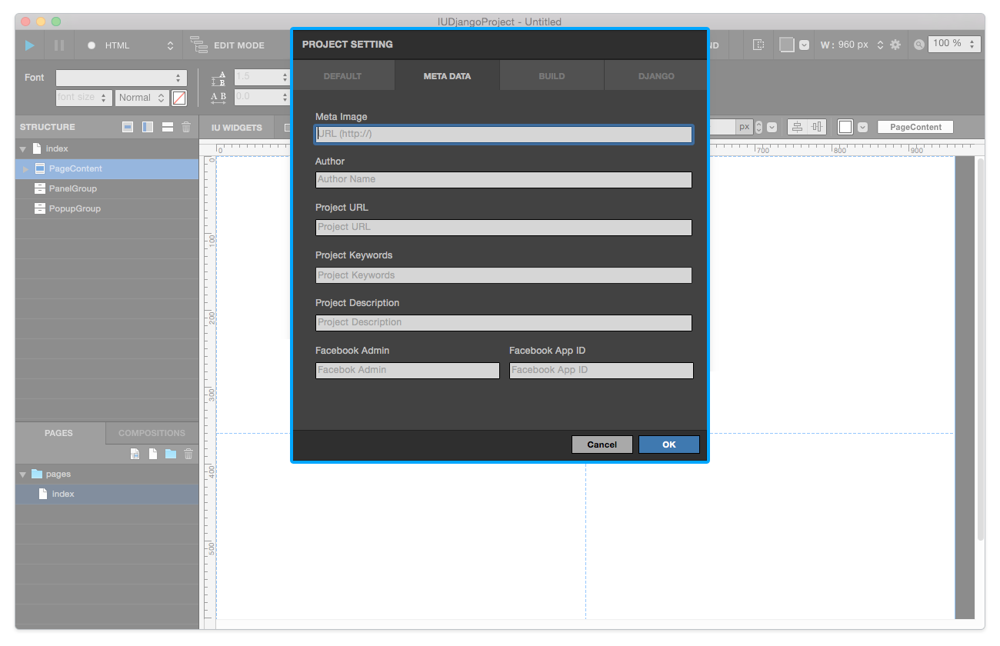
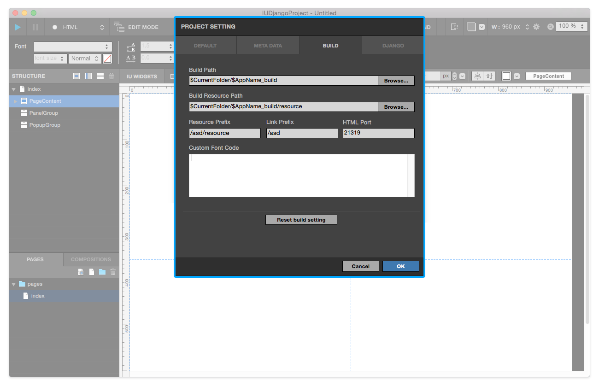
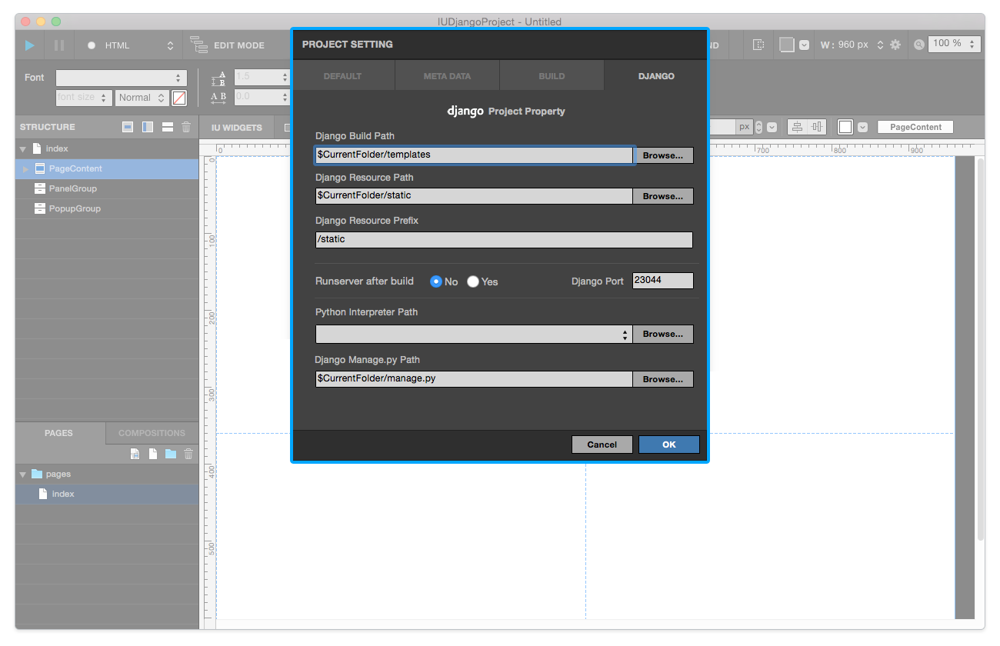

.. _Default : #id2
.. _Meta : #id3
.. _Build : #id4
.. _Django : #id5
.. _Django Project : ./project_type.html#django-project

Project Setting
=======================

When you run **Project > Project Setting (⇧⌘P)** menu, **Project Setting** will be shown. You can modify settings in `Default`_ , `Meta`_ , `Build`_ , `Django`_ Tab menu.

----------

Default
------------

* ``Project Title`` : Adds project title.
* ``Favicon`` : Adds favicon image. (Favicon image resource required)
* ``Custom Header Code`` : Adds custom code which will be applied to each page in current project.

.. note :: After create new project, Project Default Width cannot change.

-------------

Meta
------------

* ``Meta Image`` : Adds Meta Image for meta-data. (URL)
* ``Author`` : Adds Ahthor name for meta-data.
* ``Project URL`` : Adds Project URL for meta-data.
* ``Project Keywords`` : Adds Project Keywords for meta-data. (Multiple keywords are available)
* ``Project Description`` : Adds Project Description for meta-data.
* ``Facebook Admin`` : Adds Facebook Admin ID for meta-data.
* ``Facebook App ID`` : Adds Facebook App ID for meta-data.

------------

Build
------------

* ``Build Path`` : Set Build path for build files.
* ``Build Resource Path`` : Set Build Resource Path for build resource files.
* ``Resource Prefix`` : Set Resource Prefix. 
* ``Link Prefix`` : Set Link Prefix.
* ``HTML Port`` : Set HTML Port for build.

.. note :: If your project's domain isn't same as root path, you have to modify Resource & Link Prefix.

------------

Django
------------

.. note :: Django tab available on `Django Project`_ .

* ``Django Build Path`` : Set Django Build path for Django build files.
* ``Django Resource Path`` : Set Django Resource Path for Django resource files.
* ``Django Resource Prefix`` : Set Django Resource Prefix.
* ``Runserver after build`` : Set Runserver option.
* ``Django Port`` : Set Django Port for Django build.
* ``Python Interpreter Path`` : Set Python Interpreter Path for Django build.
* ``Django Manage.py Path`` : Set Manage.py path for Django build.