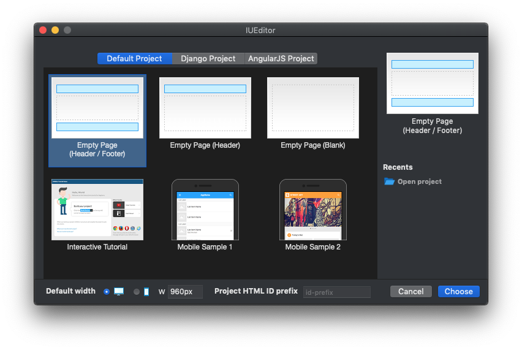

Project Type
=======================

.. image:: resource/icon_IU_128x128.png

-------------

Default Project
--------------------------

Default Project is a Static Project which is not connected with Backend. You can select Default Project in **New Project Popup** (When you run **File > New Project (⌘N)** menu, **New Project Popup** will be shown.)

* ``Empty Page (Header / Footer)`` : Creates new project with **Empty Page (Header / Page Content / Footer)**
* ``Empty Page (Header)`` : Creates new project with **Empty Page (Header / Footer)**
* ``Empty Page (Blank)`` : Creates new project  with **Empty Page (Page Content)**

* ``IUPro`` : Creates new project with **IUPro** Template.
* ``Paper`` : Creates new project with **IUPaper** Template.
* ``IUAcademy`` : Creates new project with **IUAcademy** Template.

* ``Recent Project`` : Shows recent 5 projects that recently have been updated.
* ``Open Project`` : Opens IU project.

.. note :: When you selected Empty Page, you can set default width value of new project.

-------------

Django Project
-----------------------

Django Project is a Dynamic Project which can be connected with Backend. You can select Default Project in **New Project Popup** (When you run **File > New Project (⌘N)** menu, **New Project Popup** will be shown.)

.. image:: resource/iu_manual_project_new_django.png

-------------

Angular Project
-----------------------

AngularJS Project is a Dynamic Project which can be connected with Backend. You can select Default Project in **New Project Popup** (When you run **File > New Project (⌘N)** menu, **New Project Popup** will be shown.)

.. image:: resource/iu_manual_project_new_angularjs.png

-------------

Wordpress Project
-----------------------

Wordpress Project is a Dynamic Project which can be connected with Wordpress. This feature is under developing.

