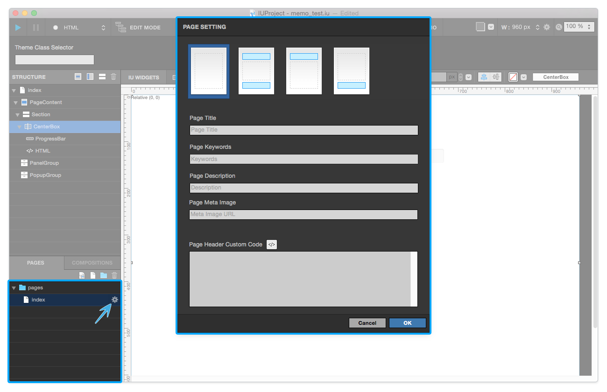
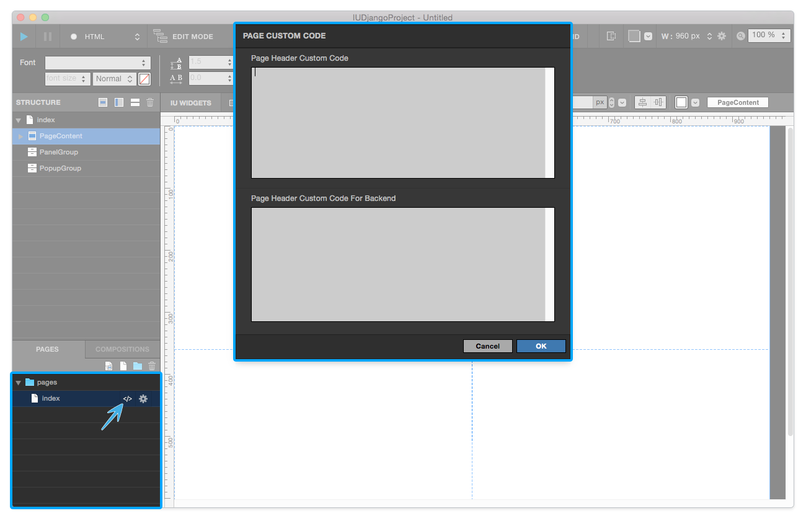
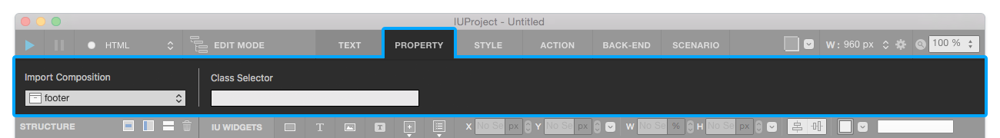
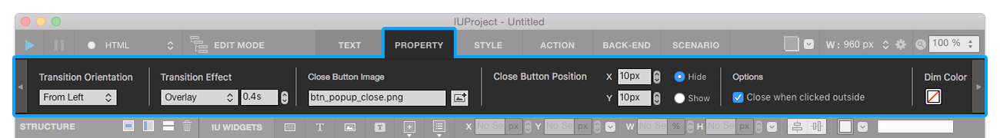
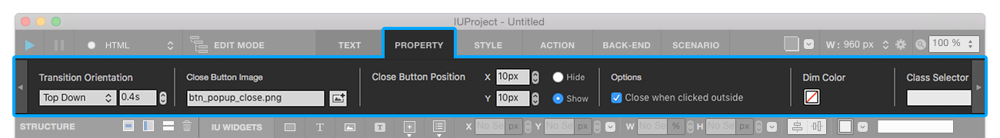

Page
============

-------------

Page Setting
-----------------------

When you click the **Page Setting** button, Page Setting panel will be shown.

* **Empty Layout** : Set **Empty (Page Content) Page Layout** .
* **Header + Footer** : Set **Header + Page Content + Footer Page Layout** .
* **Header** : Set **Header + Page Content Page Layout** 
* **Footer** : Set **Footer + Page Content Page Layout** 

* **페이지 타이틀 Page Title** : Adds Page Title to current page.
* **페이지 키워드 Page Keyword** : Adds Page Keywords to current page. (Multiple keywords available)
* **페이지 설명 Page Description** : Adds Page Description to current page.
* **페이지 메타 이미지 Page Meta Image** : Adds Meta Image to current page. (URL)

-------------

Page Custom Code
-----------------------

When you click the **Page Custom Code** button, Page Custom Code panel will be shown.

* **Page Header Custom Code** : Adds Custom Code in header of current page.
* **Page Header Custom Code for Backend** : Adds Custom Code for Backend in header of current page.

-------------

Page Default Widget
----------------------------

**Page**
.. image:: resource/iu_manual_prop_basic_IUPage.png 
IUPage is same as html document. You can change page structure in property tab.

.. image:: resource/widget/IUHeader.png
**Header**
.. image:: resource/iu_manual_prop_basic_IUHeader.png 
Header is placed top of page. Header can import **Header or another composition** .

**Page Content** 
Page Content is placed middle of page (Page Content cannot be removed). You can add sections in Page Content.

**Footer** 

Footer is placed bottom of page. Footer can import **Footer of another composition** .

**Section** 
Section is placed under Page Content. 

.. image:: resource/widget/IUCenterBox.png
**Centered Box** 
Centered Box is placed under Section (Centered Box can be removed). Centered Box used for horizontal-center layout.

**Panel** 

You can add a panel by press [+] button of panel group. To call panel, create link with any widget and select link target to panel. 

.. image:: resource/widget/IUPopUp.png
**Popup** 

You can add a popup by press [+] button of popup group. To call popup, create link with any widget and select link target to popup. 
