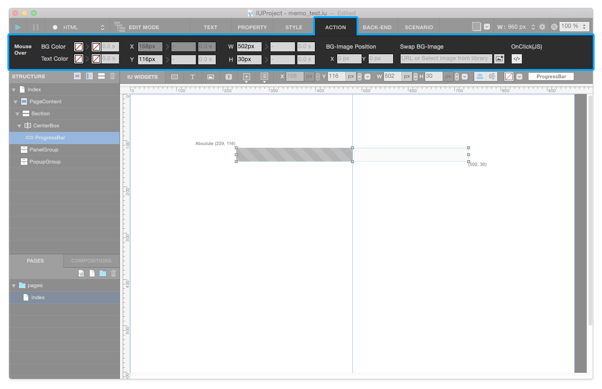
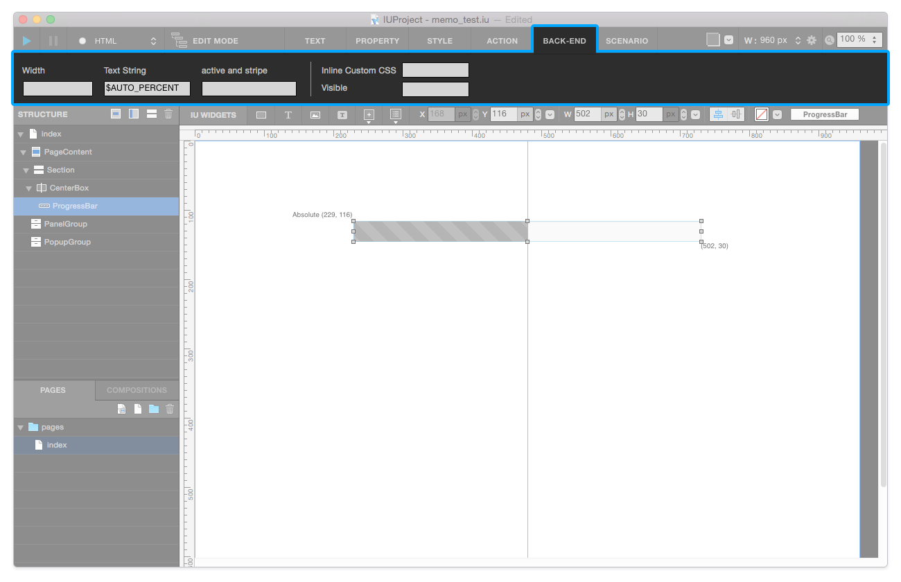

Top Toolbar
===========

.. image:: resource/iu_manual_top_toolbar.png

**Top Toolbar** has ``Command`` | ``Tab Menu`` | ``Tracing`` | ``Page Setting`` | ``Zoom`` area. 

----------

.. image:: resource/iu_manual_top_toolbar_command.png

Command
-------

Command area contains ``Build`` | ``Server Stop`` | ``Select Build-Type`` `button`.

* ``Build`` : Generates  HTML & CSS & JS files based on IU Project's canvas.
* ``Server Stop`` : Stops localhost server.
* ``Select Build-Type`` : Select Build-Type to Build. (HTML or Django)

----------

Tab Menu
--------

Tab Menu area contains 6 tabs - Text, Property, Style, Action, Back-End.

.. image:: resource/iu_manual_top_toolbar_tab01_text.png

Text Tab
--------

In Text Tab, you can modify ``font-family``, ``font-weight``, ``font-size``, ``line-height``, ``heading``, ``font-color``, ``font-align``.

.. image:: resource/iu_manual_top_toolbar_tab02_property.png

Property Tab
------------

In Property Tab, you can change properties of each Widgets. Each Widget has individual property panels.

.. image:: resource/iu_manual_top_toolbar_tab03_style.png

Style Tab
---------

In Style Tab, you can modify ``radius``, ``border``, ``box-shadow``, ``opacity``, ``background-image``.

Action Tab
----------

In Action Tab, you can add Mouse-Over actions to each widgets. (e.g. ``BG-color``, ``Text-Color``, ``X-position``, ``Y-position``, ``width``, ``height``, ``BG-image position``, ...)

Back-End Tab
------------

In Back-end Tab, you can insert ``Variables`` to certain widget. (This feaure available only on Django Project.)

----------

.. image:: resource/iu_manual_top_toolbar_TQZ.png

Tracing
-------

With Tracing Feature, you can add virtual background image into your canvas, so that you can create design quickly.

Page Setting
------------

You can modify Page Setting that ``Page Width`` and ``Media Query``.

* ``Page Width`` : You can select page-width in your IU Project.
* ``Media Query`` : You can add & remove Media Query whatever you need.

Zoom
----

Select Zoom-In / Out to your IU Project.