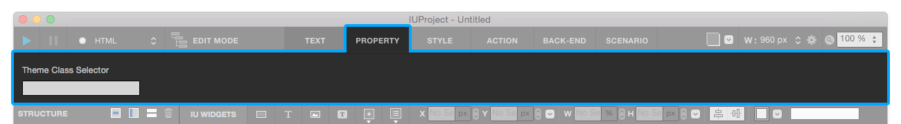
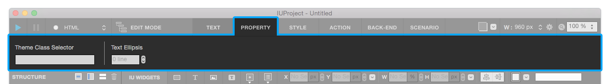
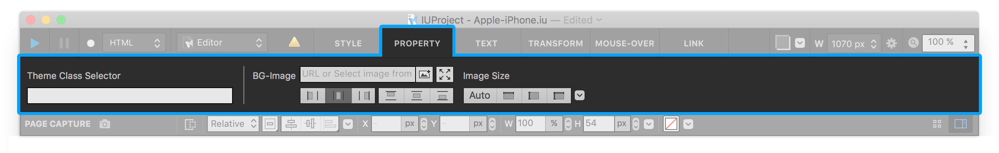
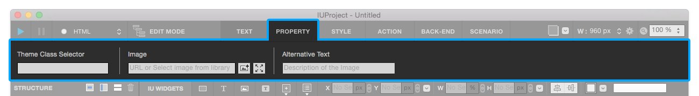

Basic Widget
============

-----------

Box
----------

Box widget is a fundamental widget which is generated to 
 tag. Mostly, Box widget is used to set layout and to group children widgets.

**Property**

* Child : Valid
* Link : Valid
* Scroll Animator : Valid
* Background Image : Valid
* Backend Ellipsis : Invalid

----------

.. image:: resource/widget/IUText.png

Text 
----------

Text widget contains **Text Content** which is generated to 
, <h1> or <h2> tag. You can edit text after double-click to widget. 

**Property**

* Child : Invalid
* Link : Valid
* Scroll Animator : Valid
* Background Image : Valid
* Backend Ellipsis : Valid

----------

Static Image
----------

Static Image widget contains **Image Content** which is generated by css {background} tag. You can input image resource from Resource panel or Image URL link and resize or rearrange image in widget area.

* ``Fit Widget Size to Image Size`` : Resize widget according to image resource size.

**Property**

* Child : Invalid
* Link : Valid
* Scroll Animator : Valid
* Background Image : Invalid
* Backend Ellipsis : Invalid

----------

Image
----------

Image widget contains **Image Content** which is generated to  tag. You can input image resource from Resource panel or Image URL link. 

* ``Fit Widget Size to Image Size`` : Resize widget according to image resource size.

**Property**

* Child : Invalid
* Link : Valid
* Scroll Animator : Valid
* Background Image : Valid
* Backend Ellipsis : Valid

----------

Cell
----------

Cell widget contains **Text Content** , aligned Vertical-Center automatically. (PX unit only)

**Property**

* Child : Invalid
* Link : Valid
* Scroll Animator : Valid
* Background Image : Valid
* Backend Ellipsis : Valid

----------

