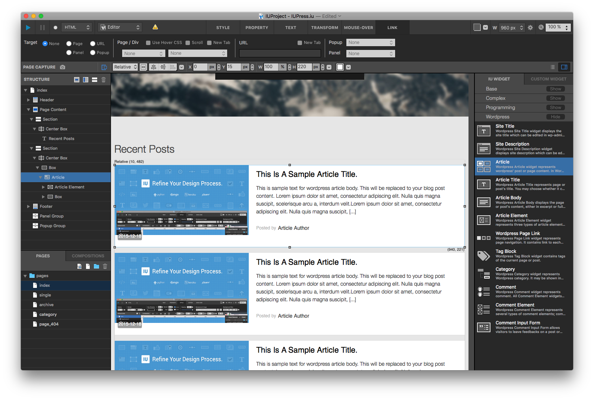
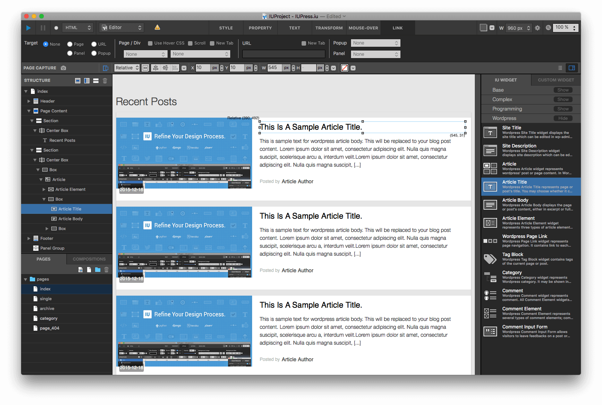
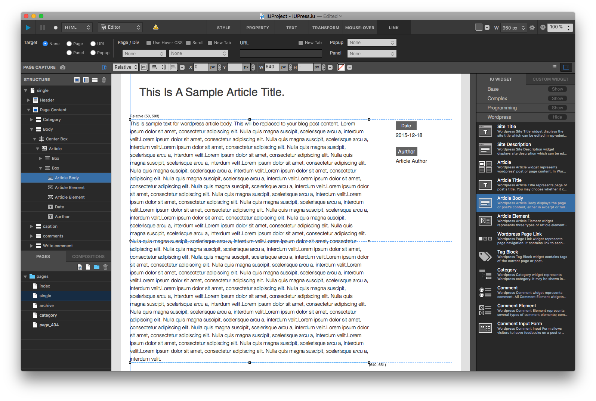
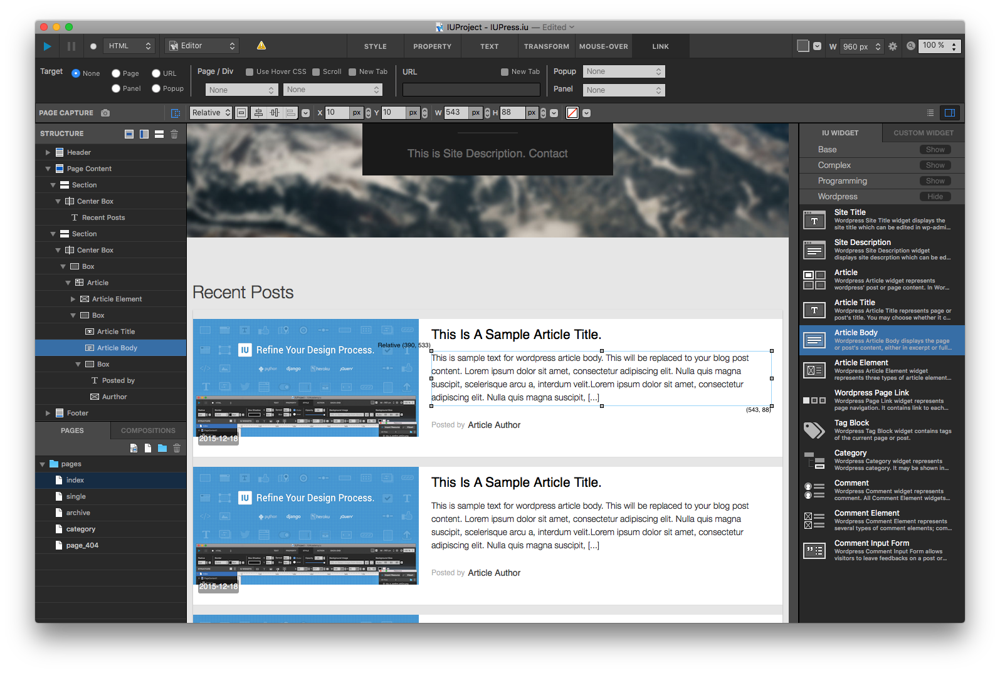
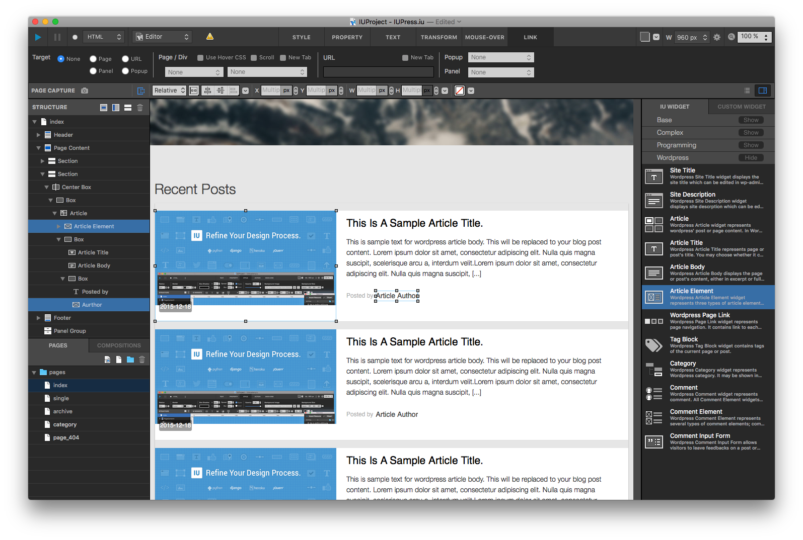

Article
==========

In IUEditor, Article represents a WordPress article such as a post, a page. It may contain subject, content, thumbnail, date and author as its elements.

Article Widget
----------------

* A core widget of WordPress theme, which contains Article Elements.
* An Article widget inserted in a theme may be replaced as a single post (in single.php) or a list of multiple posts (in index.php, archive.php, etc) depending on the context.
* You may control the number of Article samples in the editor with Sample Repeat setting in Property tab, and it would be helpful for layout work.

  * For repeated print, Position has to be Relative.
* Article Element, Comment, Comment Input Form, Tag Block widgets must be inserted under Article widget.

------------

Article Title
------------

* Prints the parent Article's title. (WordPress post/page title)
* Works well only under an Article widget.
* You may chooose to make it either link or plain text in Property tab.

------------

Article Body
------------

* Prints the Article's content body.
* Works well only under an Article widget.
* You may choose to make it display either full text or excerpt with Type setting in Property tab.

  * When Excerpt chosen, you can control the length of the excerpt as the number of words with excerpt length setting in Property tab. (55 default)
* You may choose to make it either link or plain text in Property tab.

------------

Article Element
------------

* Prints one of elements of the Article (thumbnail, author or date)

  * You can choose which element to display with Element Type setting in Property tab.
* Works well only under an Article widget.
* You may choose to make it either link or plain text in Property tab.
