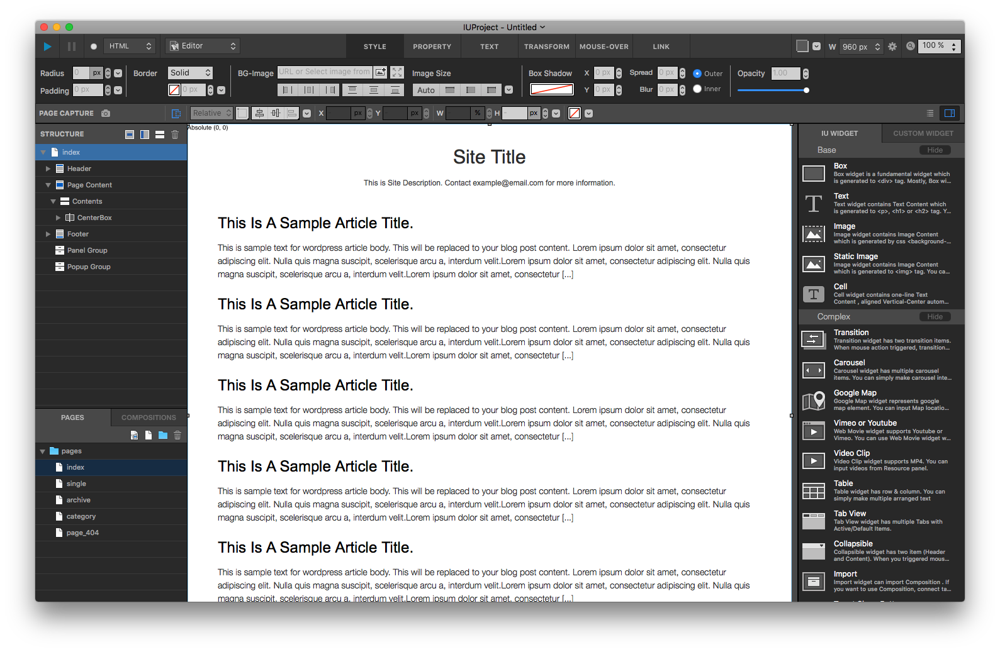
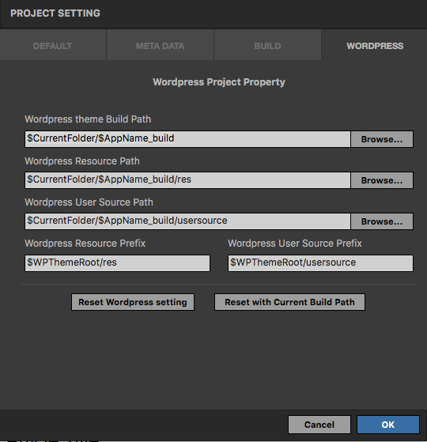

Wordpress Basic Usage
==========

Introduction
-----------

You can generate a Wordpress theme with IUEditor, utilizing all the powerful features.

.. images:: resource/wordpress/iu_manual_wordpress_basic_ues_newproject.png

* From new project window, click Wordpress tab and choose pre-built template to start with.

* You may insert Wordpress widgets (at the bottom right of the editor window) to locate and design Wordpress theme elements.

---------

Anatomy of Pages
-------------

* ``index``: A required page that  블로그 홈 화면 및 테마 전체의 기본이 되는 필수 페이지 입니다.
* ``single``: Single page template which is shown when a visitor enter to a specific post.
* ``archive``: Archive page template to show pages retrieved by an author-based or period-based
* ``category``: Category page template 특정 카테고리내 글 목록을 조회할때 출력되는 페이지 입니다.
* ``page_404``: 404 page template shown when a visitor enter to a wrong URL.

In addition, users can add any other pages required for Wordpress template.
그 외 테마에 필요한 페이지는 사용자가 임의로 추가할 수 있습니다. (예: page.php, date.php 등)

.. Note:: 워드프레스 테마의 페이지 구성에 대해 좀 더 자세한 정보는 다음 링크를 참조하시기 바랍니다. https://yoast.com/wordpress-theme-anatomy/

-------------

설정 Setting
--------------

**프로젝트 > 프로젝트 셋팅** 메뉴를 실행하거나 **⇧⌘P** 키를 입력해 프로젝트 셋팅 패널을 열고, 워드프레스 Wordpress 탭을 선택해 워드프레스 관련 설정을 변경할 수 있습니다.

* Wordpress theme Build Path: 생성된 테마 파일들을 출력할 경로입니다. 경로끝에 $AppName을 입력해 프로젝트명으로 최종 경로를 만들 수 있습니다.
* Wordpress Resource Path: 이미지, CSS 등 테마 파일의 리소스가 저장될 로컬 경로입니다.
* Wordpress User Source Path: 사용자가 추가로 삽입한 CSS, JSS 파일들이 저장될 로컬 경로입니다.
* Wordpress Resource Prefix: 웹 상에서 Resource Path에 접근하는 URL 경로입니다.
* Wordpress User Source Prefix: 웹 상에서 User Source Path에 접근하는 URL 경로입니다.

----------
