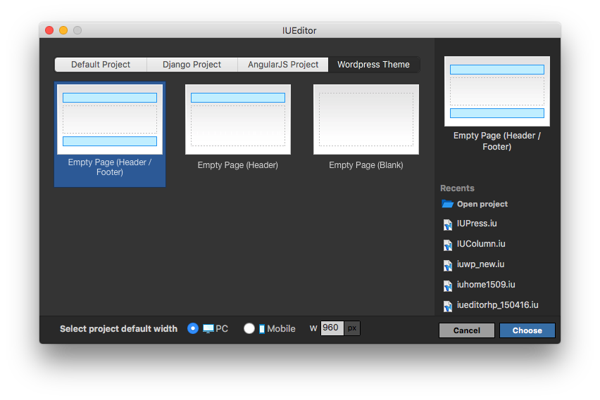

WordPress: Basic Usage
==========

.. Note:: Video tutorial for IUEditor WordPress theme is available at:  https://www.youtube.com/watch?v=ZbjSCoE0Ano&list=PLWlO_EZgRC0aLLZ-oe_yMqdEaV4KdM5-l&index=1

Introduction
-----------

You can generate a WordPress theme with IUEditor, using all of its powerful and convenient features.

* From a new project window, click WordPress tab and choose any default page sturucture or pre-built template to start with.

.. image:: resource/wordpress/iu_manual_wordpress_basic_use_widgetgroup.png

* You may insert WordPress widgets (at the bottom right of the editor window) to locate and design WordPress theme elements.

---------

Anatomy of Pages
-------------

.. image:: resource/wordpress/iu_manual_wordpress_basic_use_theme_anatomy.png

* ``index``: A basic, required page. This page represents home screen of the WordPress blog, also works as a default template in case of other page templates' absence.
* ``single``: Single page template which is shown when a visitor enters to a specific post link.
* ``archive``: Archive of page templates to show posts retrieved by an author or during certain period
* ``category``: Category of page templates used to display posts in a certain category
* ``page_404``: 404 page template shown when a visitor enters to a wrong URL.

In addition, user can add more pages when WordPress template is needed. (ex: page.php, date.php, and so on)

.. Note:: For more detailed information about anatomy of WordPress theme, please refer to the following link: https://yoast.com/wordpress-theme-anatomy/

-------------

Settings
--------------

.. image:: resource/wordpress/iu_manual_wordpress_basic_use_buildsetting.png

You can follow **Project > Project Setting** menu or press **⇧⌘P** to open Project Setting window, then click WordPress tab to change settings for WordPress features.

* ``WordPress theme Build Path``: Output path for generated theme files. You may add $AppName at the end of the path so that the final path contains the name of the project at the end.
* ``WordPress Resource Path``: Output path for the resource files of the theme, such as images, css, and so on.
* ``WordPress User Source Path``: Output path for 'User Source', which are CSS or JS files added to the project by user.
* ``WordPress Resource Prefix``: URL path to access the Resource Path on the web.
* ``WordPress User Source Prefix``: URL path to access the User Source Path on the web.

----------
