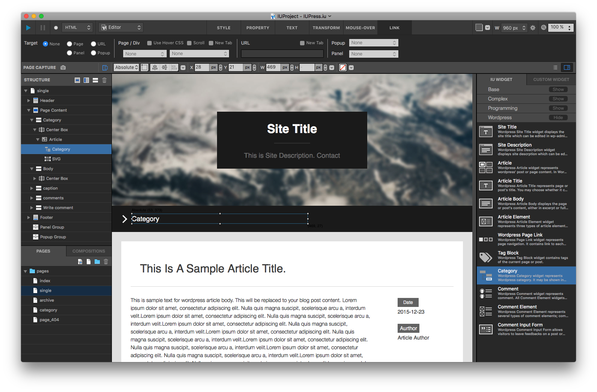
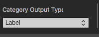
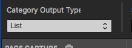
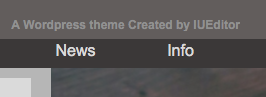
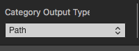
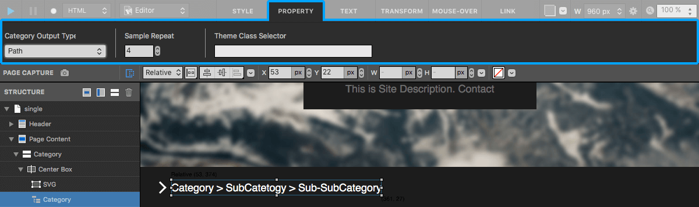

카테고리 Category
==========

워드프레스의 특정 아티클 혹은 아티클 목록의 카테고리를 출력합니다.

카테고리 위젯 Category Widget
----------------

* 카테고리를 출력하기 위해 사용되는 위젯입니다.
* 세가지 타입(레이블, 리스트, 경로) 중 선택할 수 있으며, 출력형태가 달라집니다.

------------

카테고리 레이블 Category Label
------------

.. image:: resource/wordpress/iu_manual_wordpress_category_label.png

* 특정 아티클(post/page)이 소속된 카테고리가 한 번 출력됩니다.
* 아티클 위젯 하위에 삽입되어야 정상 동작합니다.

------------

카테고리 리스트 Category List
------------

* 현 페이지에 포함된 상위 카테고리 리스트를 출력합니다.
* 프로퍼티 탭의 Sample Repeat 설정에 따라 에디터에 반복되어 출력됩니다.

------------

카테고리 경로 Category Path
------------

* 현재 아티클이 포함된 카테고리의 경로를 나타냅니다.
