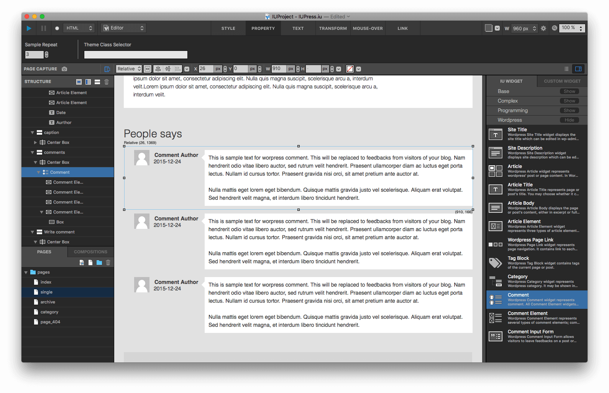
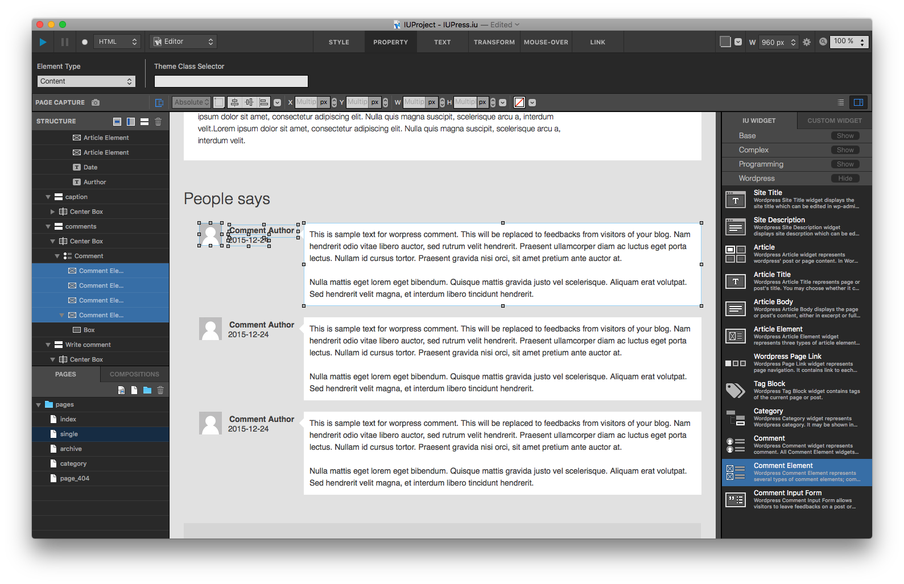
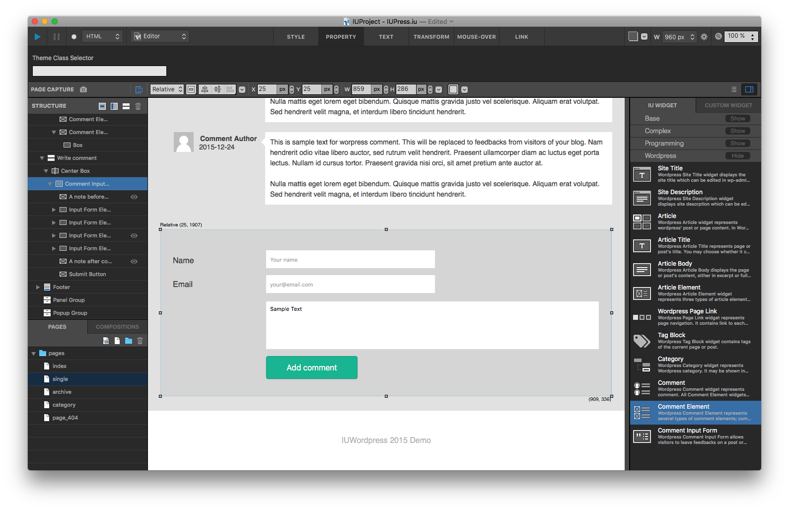

코멘트 Comment
==========

포스트에 작성된 코멘트 및 코멘트 입력폼을 디자인하는 위젯들입니다.

코멘트 위젯 Comment Widget
----------------

* 해당 아티클에 달린 코멘트들을 출력합니다.
* 아티클 위젯 하위에 삽입되어야 합니다.
* 프로퍼티 탭의 Sample Repeat에 지정된 횟수에 따라 에디터에서 코멘트 샘플이 반복출력되어 레이아웃 작업에 활용할 수 있습니다.

  * 반복출력시 포지션Position 속성이 렐러티브Relative로 설정되어야 합니다.
* 코멘트 요소들은 코멘트 위젯의 하위에 삽입되어야 합니다.

------------

코멘트 요소 Comment Element
------------

* 코멘트 위젯 하위에 삽입되어야 합니다.
* 프로퍼티탭의 타입 목록에서 코멘트 본문, 아바타, 작성자명, 날짜, 이메일, 주소 등으로 설정할 수 있습니다.

------------

코멘트 입력폼 Comment Input Form
------------

* 코멘트 입력 폼과 구성요소들을 표시합니다.
* 반드시 아티클 위젯 하위에 삽입되어야 동작합니다.
