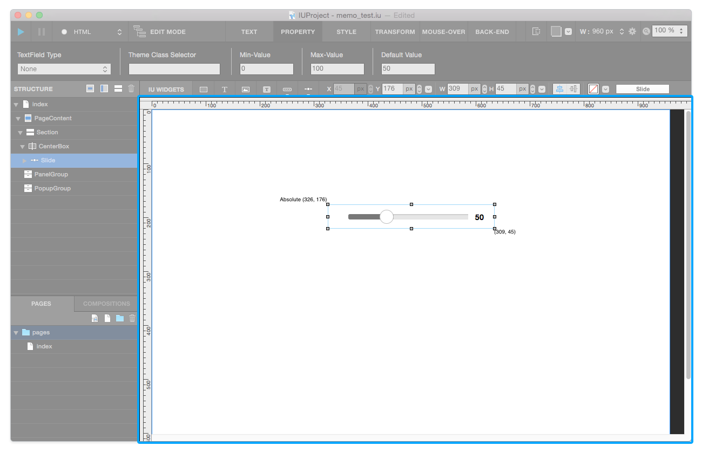
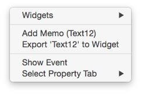
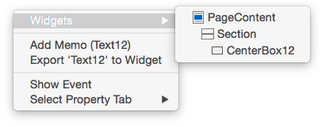
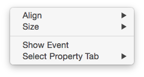
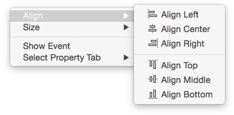
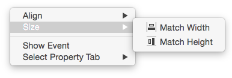

Wordpress Manual
===========

Canvas Area displays Webview based on your structure. You can *add widget* to canvas.

`How to add widget to canvas`_

----------

Context Menu - Single Widget 
----------------------------------------------

When you selected single widget in canvas, you can call **Context Menu Popup** by right-click.

* ``Widget`` : Displays whole widgets which are placed on current mouse pointer position.

* ``Add Memo`` : Opens `Memo Panel`_ that can add memo to selected widget.
* ``Export to Widget`` : Opens `Export Widget Panel`_ that can export **Custom Widget** .
* ``Show Event`` : Opens `Event Panel`_ that can add & change event to selected widget.
* ``Select Tab`` : Switches property panel to selected `Tab Menu`_

----------

Context Menu - Muiltiple Widget 
----------------------------------------------

When you selected multiple widget in canvas, you can call **Context Menu Popup** by right-click.

* ``Align`` : Aligns selected widgets according to selected option : **Align Left / Align Center / Align Right / Align Top / Align Middle / Align Bottom**

* ``Size`` : Fixes size of selected widgets according to selected option : **Match Width / Match Height**

